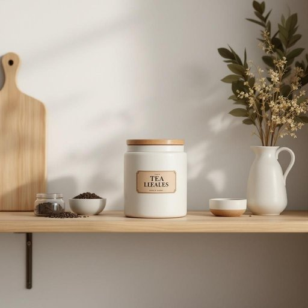

# canister

<h1 style="font-size: 2.5em; font-weight: 300; letter-spacing: 2px; margin: 0; color: #2c3e50;">
/ˈkænɪstər/
</h1>

---

---

## 例句

Could you please pass me the canister on the top shelf, the one with the airtight seal and the vintage label, so I can refill it with the loose-leaf tea before it loses its freshness?

*Could(/kʊd/) you(/ju/) please(/pliz/) pass(/pæs/) me(/mi/) the(/ðə/) canister(/ˈkænɪstər/) on(/ɔn/) the(/ðə/) top(/tɔp/) shelf,(/ʃɛlf,/) the(/ðə/) one(/wən/) with(/wɪθ/) the(/ðə/) airtight(/ˈɛrˌtaɪt/) seal(/sil/) and(/ənd/) the(/ðə/) vintage(/ˈvɪntɪʤ/) label,(/ˈleɪbəl,/) so(/soʊ/) I(/aɪ/) can(/kən/) refill(/ˈrifɪl/) it(/ɪt/) with(/wɪθ/) the(/ðə/) loose-leaf(/loose-leaf*/) tea(/ti/) before(/ˌbiˈfɔr/) it(/ɪt/) loses(/ˈluzɪz/) its(/ɪts/) freshness?(/ˈfrɛʃnəs?/)*

**翻译：** 您能帮我递一下顶层架子上的那个罐子吗？就是带有密封盖和复古标签的那个，我想趁散装茶叶还没走味之前，把它重新装满。

---

## 解释

单词“canister”在家居生活用品的语境中作为名词通常指一种小型的圆筒形或盒状容器用于储存食品如茶叶咖啡糖饼干等干货或其他小物件具有密封性以保持内容物的新鲜和防潮在家庭厨房储藏室等场合尤为常见常见表达如“a coffee canister”（咖啡罐）“a tea canister”（茶叶罐）等英语学习者在使用“canister”时需注意该词为可数名词复数形式为“canisters”常与表示内容的名词搭配构成定语短语此外canister还常与形容词如“airtight”（密封的）“metal”（金属的）“plastic”（塑料的）等搭配表达其材质或功能词源方面“canister”起源于古法语“canestellus”意为“小篮子”由“canne”（管状物）演变而来体现其容器形状的特点在中文语境中“canister”可准确翻译为“罐子”“筒子”或“密封罐”强调其储存和密封的功能没有特殊褒贬色彩属于中性词汇文化内涵较为普通主要功能性用语整体而言理解并掌握“canister”有助于描述日常厨房和家居环境中的收纳用品提高语言表达的准确性和细节描写能力

---

<small style="color: #999; font-size: 0.9em;">2025-07-27 09:14:04</small>

