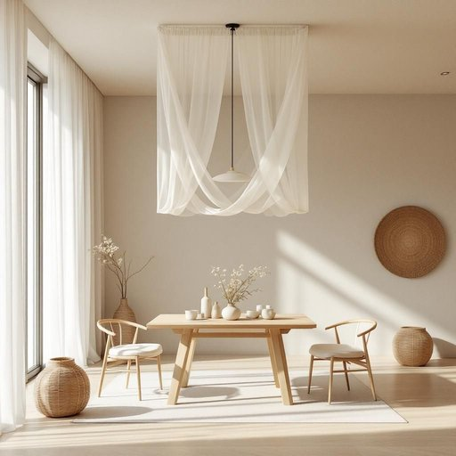

# canopy

<h1 style="font-size: 2.5em; font-weight: 300; letter-spacing: 2px; margin: 0; color: #2c3e50;">
/ˈkænəpi/
</h1>

---

---

## 例句

The canopy, serving as both a functional shelter and an aesthetic enhancement, elegantly frames the dining area while subtly diffusing light to create an inviting ambiance for family gatherings.

*The(/ðə/) canopy,(/ˈkænəpi,/) serving(/ˈsərvɪŋ/) as(/ɛz/) both(/boʊθ/) a(/ə/) functional(/ˈfəŋkʃənəl/) shelter(/ˈʃɛltər/) and(/ənd/) an(/ən/) aesthetic(/ɛsˈθɛtɪk/) enhancement,(/ɛnˈhænsmənt,/) elegantly(/ˈɛlɪgənˌtli/) frames(/freɪmz/) the(/ðə/) dining(/ˈdaɪnɪŋ/) area(/ˈɛriə/) while(/waɪl/) subtly(/ˈsətəli/) diffusing(/dɪfˈjuzɪŋ/) light(/laɪt/) to(/tɪ/) create(/kriˈeɪt/) an(/ən/) inviting(/ˌɪnˈvaɪtɪŋ/) ambiance(/ˈæmbiəns/) for(/fər/) family(/ˈfæməli/) gatherings.(/ˈgæðərɪŋz./)*

**翻译：** 遮篷既具实用遮蔽功能，又增添美感，优雅地勾勒出用餐区的轮廓，同时柔和地漫散光线，营造出温馨宜人的家庭聚会氛围。

---

## 解释

英语单词“canopy”在家居生活用品的语境中作为名词，通常指覆盖床铺或某些家具上方的帐篷式遮篷，如四柱床上的罩帐或装饰性天篷，用于遮挡光线、增加私密性或营造氛围。这一单词在实际使用时，多见于描述床上用品、户外遮阳设备或装饰性覆盖物，适用于室内或户外场景。语法上，“canopy”作名词时为可数名词，常见搭配有“bed canopy”（床罩帐篷）、“canopy frame”（帐篷框架）、“canopy net”（蚊帐），也可与动词“hang”（悬挂）、“install”（安装）等连用，强调其作为覆盖物的功能。学习者需注意其发音中的元音音素和拼写，避免与同音异义词混淆。词源方面，“canopy”源自拉丁语“cōnōpȳum”，通过希腊语“kōnōpȳion”，原意指覆盖蚊帐或保护棚子，体现其遮蔽、防护的功能，随着时间演变，意义延伸到各种覆盖物。在中文环境中，“canopy”一般准确翻译为“天篷”或“罩帐”，有时根据具体物品可译为“罩棚”、“帐篷顶”或“遮篷”，强调其作为顶盖或覆盖物的性质。该词通常无褒贬色彩，属于中性词，文化内涵上多与舒适、保护、装饰等家居环境营造相关，体现出实用性与美观性的结合。

---

<small style="color: #999; font-size: 0.9em;">2025-07-27 09:14:04</small>

