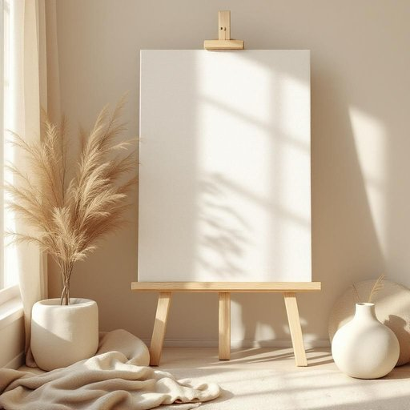

# canvas

<h1 style="font-size: 2.5em; font-weight: 300; letter-spacing: 2px; margin: 0; color: #2c3e50;">
/ˈkænvəs/
</h1>

---

---

## 例句

Could you please help me move that old canvas, which is stretched tightly over the wooden frame and has been sitting in the corner of the room since last summer, to the attic, so I can finally start painting the new landscape scene I've been sketching?

*Could(/kʊd/) you(/ju/) please(/pliz/) help(/hɛlp/) me(/mi/) move(/muv/) that(/ðət/) old(/oʊld/) canvas,(/ˈkænvəs,/) which(/wɪʧ/) is(/ɪz/) stretched(/strɛʧt/) tightly(/ˈtaɪtli/) over(/ˈoʊvər/) the(/ðə/) wooden(/ˈwʊdən/) frame(/freɪm/) and(/ənd/) has(/həz/) been(/bɪn/) sitting(/ˈsɪtɪŋ/) in(/ɪn/) the(/ðə/) corner(/ˈkɔrnər/) of(/əv/) the(/ðə/) room(/rum/) since(/sɪns/) last(/læst/) summer,(/ˈsəmər,/) to(/tɪ/) the(/ðə/) attic,(/ˈætɪk,/) so(/soʊ/) I(/aɪ/) can(/kən/) finally(/ˈfaɪnəli/) start(/stɑrt/) painting(/ˈpeɪnɪŋ/) the(/ðə/) new(/nu/) landscape(/ˈlænˌskeɪp/) scene(/sin/) I've(/aɪv/) been(/bɪn/) sketching?(/ˈskɛʧɪŋ?/)*

**翻译：** 请您帮我把那幅自去年夏天以来一直紧绷在木框架上、搁置在房间角落的旧画布移到阁楼去，好让我终于开始着手绘制我一直在速写的新风景画。

---

## 解释

英语单词“canvas”作为名词在家居生活用品的语境中，通常指的是一种结实、厚重的帆布或油画布，广泛用于制作帐篷、沙发套、窗帘、靠垫套以及手提包等耐用的布料材料。具体使用场合多见于描述家具面料、家居装饰或户外用品时，例如“The sofa is covered with beige canvas”（沙发套用米色帆布做成）。英语学习者需注意“canvas”作为可数和不可数名词均可，复数形式为“canvases”，且常与颜色、质地、用途等词语连用，比如“canvas fabric”，“canvas bag”，“canvas print”等。此外，表达时常用固定搭配有“canvas material”（帆布材料）、“canvas cover”（帆布罩）等。词源上，“canvas”源自中古英语，进一步来自古法语“canevas”，而该词源自拉丁语“cannabis”，意指用大麻制作的布料，反映了其原始材质和用途。中文中常将“canvas”译为“帆布”，强调其耐用厚实的特性，适合家居生活中作为实用布料使用，无明显褒贬含义，但因其材质粗犷，可能不适用于非常精致或奢华的场合。因此，在中文理解上，应准确将其视为一种实用性强且质地粗犷的家用布料，而非普通的棉布或丝绸，以避免误解。

---

<small style="color: #999; font-size: 0.9em;">2025-07-27 09:14:04</small>

