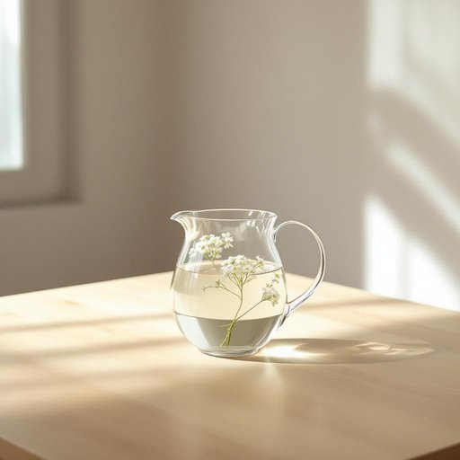

# carafe

<h1 style="font-size: 2.5em; font-weight: 300; letter-spacing: 2px; margin: 0; color: #2c3e50;">
/kəˈræf/
</h1>

---

---

## 例句

Could you please pass me the carafe from the dining table, the one filled with the homemade elderflower cordial, so that I can pour everyone a refreshing drink while we settle down for the afternoon tea?

*Could(/kʊd/) you(/ju/) please(/pliz/) pass(/pæs/) me(/mi/) the(/ðə/) carafe(/kəˈræf/) from(/frəm/) the(/ðə/) dining(/ˈdaɪnɪŋ/) table,(/ˈteɪbəl,/) the(/ðə/) one(/wən/) filled(/fɪld/) with(/wɪθ/) the(/ðə/) homemade(/ˈhoʊˈmeɪd/) elderflower(/elderflower*/) cordial,(/ˈkɔrʤəl,/) so(/soʊ/) that(/ðət/) I(/aɪ/) can(/kən/) pour(/pɔr/) everyone(/ˈɛvriˌwən/) a(/ə/) refreshing(/rɪˈfrɛʃɪŋ/) drink(/drɪŋk/) while(/waɪl/) we(/wi/) settle(/ˈsɛtəl/) down(/daʊn/) for(/fər/) the(/ðə/) afternoon(/ˌæftərˈnun/) tea?(/ti?/)*

**翻译：** 请把餐桌上的那个瓶子递给我，就是装着自制接骨木花糖浆的那个，好让我给大家倒上一杯清爽的饮品，大家在这里安顿下来享用下午茶。

---

## 解释

英语单词“carafe”作为名词，在家居生活用品场景中通常指一种无盖的、较为优雅的宽口玻璃或陶瓷容器，主要用于盛装和倒酒、水或果汁等饮品，常见于餐桌或茶酒时间。具体使用场合多是在正式或半正式的饮食环境，例如餐厅、家庭聚会或咖啡厅中，用于替代瓶装饮料，方便分装和饮用。英语学习者在使用“carafe”时需注意其作为可数名词，通常形容词修饰或与数量词连用，如“A glass carafe”或“Two carafes of water”，且与介词“of”搭配表示所装液体（如carafe of wine）常见。此外，“carafe”不像“bottle”那样有瓶盖，多用于开放式容器；在表达技巧上，使用“carafe”可提升语言正式度和优雅感，避免使用过于口语化的“bottle”。词源方面，“carafe”源自法语，进一步源自意大利语“caraffa”，其起源可追溯至阿拉伯语，从中世纪传入欧洲，体现了饮具的文化交流与演变。在中文语境中，“carafe”多译为“醒酒器”、“无盖水壶”或“玻璃水壶”，强调其无盖和盛水或酒的特征，区别于带盖的酒瓶或水瓶。该词本身无褒贬色彩，但因其优雅和正式的使用场合，常带有一定的高雅或精致生活的文化内涵。

---

<small style="color: #999; font-size: 0.9em;">2025-07-27 09:14:04</small>

