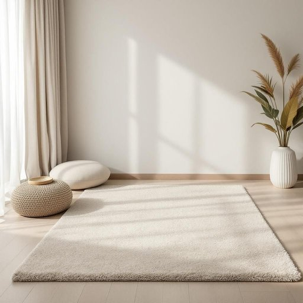

# carpet

<h1 style="font-size: 2.5em; font-weight: 300; letter-spacing: 2px; margin: 0; color: #2c3e50;">
/ˈkɑrpət/
</h1>

---

---

## 例句

After we finally chose a colour that complemented both the walls and the curtains, we decided that the best way to tie the whole room together would be to get a thick, plush carpet that not only felt cosy underfoot but also helped to dampen the sound from the bustling street outside.

*After(/ˈæftər/) we(/wi/) finally(/ˈfaɪnəli/) chose(/ʧoʊz/) a(/ə/) colour(/ˈkələr/) that(/ðət/) complemented(/ˈkɑmpləˌmɛntɪd/) both(/boʊθ/) the(/ðə/) walls(/wɔlz/) and(/ənd/) the(/ðə/) curtains,(/ˈkərtənz,/) we(/wi/) decided(/ˌdɪˈsaɪdɪd/) that(/ðət/) the(/ðə/) best(/bɛst/) way(/weɪ/) to(/tɪ/) tie(/taɪ/) the(/ðə/) whole(/hoʊl/) room(/rum/) together(/təˈgɛðər/) would(/wʊd/) be(/bi/) to(/tɪ/) get(/gɪt/) a(/ə/) thick,(/θɪk,/) plush(/pləʃ/) carpet(/ˈkɑrpət/) that(/ðət/) not(/nɑt/) only(/ˈoʊnli/) felt(/fɛlt/) cosy(/ˈkoʊzi/) underfoot(/ˌəndərˈfʊt/) but(/bət/) also(/ˈɔlsoʊ/) helped(/hɛlpt/) to(/tɪ/) dampen(/ˈdæmpən/) the(/ðə/) sound(/saʊnd/) from(/frəm/) the(/ðə/) bustling(/ˈbəsəlɪŋ/) street(/strit/) outside.(/ˈaʊtˈsaɪd./)*

**翻译：** 在我们最终选定了一种既能与墙壁又能与窗帘相得益彰的颜色后，我们认为将整个房间统一起来的最佳方式，是铺上一块厚实柔软的地毯，不仅脚感温馨舒适，还能有效缓和外面喧嚣街道的噪音。

---

## 解释

英语单词“carpet”作为家居生活用品中的名词，通常指覆盖在地面上的织物材料，用于装饰和保暖，常见于客厅、卧室、办公室等室内空间，具体使用场合多为铺设在地板上以增加舒适感、防滑或美化环境。在学习和使用时，需注意“carpet”多指较厚实的地毯，可与“rug”（小块地毯）区分；其复数形式为“carpets”，且常见固定搭配有“wall-to-wall carpet”（指全铺地毯），“patterned carpet”（有图案的地毯）等。此外，“carpet”在动词形式中有“训斥”的含义，但作为名词时无此义。词源上，“carpet”源自中古法语“carpette”，进一步来源于意大利语“carpita”，意为“覆盖物”，最早指纺织的覆盖物，用于装饰和保护地面。中文里，“carpet”准确翻译为“地毯”，强调其铺设在地面上的织物性质，区别于“地垫”或“地毯片”等较小面积物件。该词一般无褒贬含义，属于中性词汇，但在不同文化环境中，使用“carpet”表达的场合和档次可能有所不同，如全铺地毯通常象征较为正式或豪华的室内环境。

---

<small style="color: #999; font-size: 0.9em;">2025-07-27 09:14:04</small>

