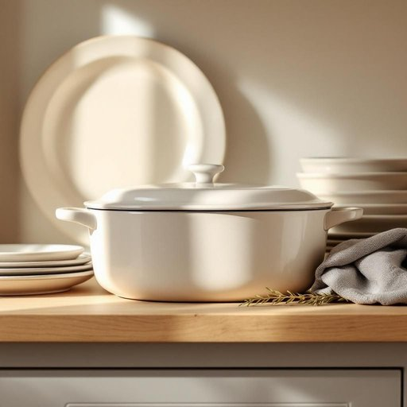

# casserole

<h1 style="font-size: 2.5em; font-weight: 300; letter-spacing: 2px; margin: 0; color: #2c3e50;">
/ˈkæsərˌoʊl/
</h1>

---

---

## 例句

After carefully washing the casserole, which had been used to bake last night’s lasagne, she placed it back in the cupboard alongside the other oven-proof dishes, making sure it was perfectly dry to prevent any musty smells from developing over the coming weeks.

*After(/ˈæftər/) carefully(/ˈkɛrfəli/) washing(/ˈwɑʃɪŋ/) the(/ðə/) casserole,(/ˈkæsərˌoʊl,/) which(/wɪʧ/) had(/hæd/) been(/bɪn/) used(/juzd/) to(/tɪ/) bake(/beɪk/) last(/læst/) night’s(/night’s*/) lasagne,(/lasagne*,/) she(/ʃi/) placed(/pleɪst/) it(/ɪt/) back(/bæk/) in(/ɪn/) the(/ðə/) cupboard(/ˈkəbərd/) alongside(/əˈlɔŋˈsaɪd/) the(/ðə/) other(/ˈəðər/) oven-proof(/oven-proof*/) dishes,(/ˈdɪʃɪz,/) making(/ˈmeɪkɪŋ/) sure(/ʃʊr/) it(/ɪt/) was(/wɑz/) perfectly(/ˈpərfəktli/) dry(/draɪ/) to(/tɪ/) prevent(/prɪˈvɛnt/) any(/ˈɛni/) musty(/ˈməsti/) smells(/smɛlz/) from(/frəm/) developing(/dɪˈvɛləpɪŋ/) over(/ˈoʊvər/) the(/ðə/) coming(/ˈkəmɪŋ/) weeks.(/wiks./)*

**翻译：** 她仔细清洗了昨晚用来烤千层面的砂锅，然后将其放回橱柜，与其它耐烤器皿并排摆放，确保完全干燥，以防未来几周内出现任何霉味。

---

## 解释

英语单词“casserole”在家居生活用品语境中作为名词，通常指一种耐热的深烤盘或带盖的砂锅，常用于烘焙或炖煮菜肴，尤其是西餐中的“焗菜”或“砂锅菜”。具体使用场合多出现在厨房、烹饪、用餐准备及家庭聚餐等语境中，表示用来直接在烤箱中烹饪并随后端上桌的器皿。英语学习者在使用“casserole”时需要注意该词为可数名词，常见表达包括“a casserole dish”（一个砂锅）、“to bake a casserole”（烘焙一道砂锅菜），以及习惯搭配如“casserole recipe”（焗菜食谱）、“casserole meal”（焗菜饭菜）。此外，“casserole”也可引申指用该器皿烹制的菜肴，尤指混合多种食材的焗菜，这时作为菜名时同样视为可数名词。词源方面，“casserole”源自法语，原意为“锅、小锅”，本身源自拉丁语“cattia”，法语中长期用于描述烹饪用的瓷器或陶器容器，进入英语则特别指耐热的烤盘。中文中，“casserole”一般准确翻译为“砂锅”或“焗锅”，强调其烹饪与上桌一体化的功能；在日常理解上，也可以指用于焗制的“砂锅菜”或“焗菜”。该词无明显褒贬色彩，属于中性词汇，反映的是一种实用的烹饪器皿及菜式概念，文化内涵多和西方家庭烹饪传统相关，体现便捷和家庭式料理的特点。

---

<small style="color: #999; font-size: 0.9em;">2025-07-27 09:14:04</small>

