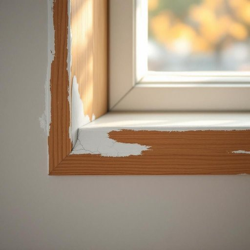

# caulk

<h1 style="font-size: 2.5em; font-weight: 300; letter-spacing: 2px; margin: 0; color: #2c3e50;">
/kɔk/
</h1>

---

---

## 例句

Before we start repainting the kitchen window frames, we need to check if the old, cracked caulk around the edges has been properly removed, as failing to do so could cause the new sealant to peel off prematurely, leading to drafts and potential water damage.

*Before(/ˌbiˈfɔr/) we(/wi/) start(/stɑrt/) repainting(/riˈpeɪntɪŋ/) the(/ðə/) kitchen(/ˈkɪʧən/) window(/ˈwɪndoʊ/) frames,(/freɪmz,/) we(/wi/) need(/nid/) to(/tɪ/) check(/ʧɛk/) if(/ɪf/) the(/ðə/) old,(/oʊld,/) cracked(/krækt/) caulk(/kɔk/) around(/əraʊnd/) the(/ðə/) edges(/ˈɛʤɪz/) has(/həz/) been(/bɪn/) properly(/ˈprɑpərli/) removed,(/riˈmuvd,/) as(/ɛz/) failing(/ˈfeɪlɪŋ/) to(/tɪ/) do(/du/) so(/soʊ/) could(/kʊd/) cause(/kɔz/) the(/ðə/) new(/nu/) sealant(/ˈsilənt/) to(/tɪ/) peel(/pil/) off(/ɔf/) prematurely,(/ˌpriməˈʧʊrli,/) leading(/ˈlidɪŋ/) to(/tɪ/) drafts(/dræfts/) and(/ənd/) potential(/pəˈtɛnʃəl/) water(/ˈwɔtər/) damage.(/ˈdæmɪʤ./)*

**翻译：** 在重新粉刷厨房窗框之前，我们需要仔细检查边缘处旧的开裂密封胶是否已被彻底清除，否则新密封剂可能会提前脱落，导致漏风甚至潜在的水损害。

---

## 解释

英语单词“caulk”在家居生活用品的语境中作为名词，指的是用于密封建筑缝隙、防止空气、水分或虫害渗入的填缝材料，通常呈膏状或胶状，常见于厨房、浴室或窗户等处，具体使用场合多为装修、维修、密封门窗缝隙、浴缸和水槽边缘防水等场景。英语学习者在使用“caulk”时需要注意其作为名词时多用于不可数形式，即“caulk”泛指密封材料，少数情况下也见可数形式“a caulk”作为某种特定类型的密封剂，但较少见；同时，“caulk”常与动词“apply”（涂抹）、“remove”（去除）等搭配，如“apply caulk”、“remove the old caulk”。词源方面，“caulk”源自中古英语“cawcen”或“calken”，进而来自古英语“cealcian”，与“chalk”（粉笔）同源，原指用石灰或类似物质填充缝隙，早期用于船只防水密封，后来扩展至建筑领域。中文中，“caulk”准确翻译为“填缝剂”或“密封膏”，强调其防水密封功能，在实际生活中通常理解为用于填补门窗或浴池等缝隙的材料，无明显褒贬色彩，也无特殊文化内涵，仅属于实用性强的建筑材料术语，学习时注意与类似材料如“sealant”、“putty”等区分，前者多指更柔软或用途广泛的密封材料，后者则偏向粘土状填料。

---

<small style="color: #999; font-size: 0.9em;">2025-07-27 09:14:04</small>

