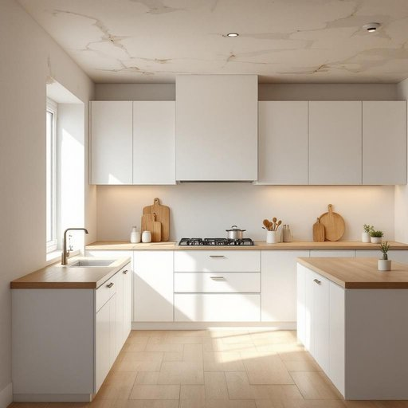

# ceiling

<h1 style="font-size: 2.5em; font-weight: 300; letter-spacing: 2px; margin: 0; color: #2c3e50;">
/ˈsilɪŋ/
</h1>

---

---

## 例句

Although the kitchen had been recently renovated with new cabinets and a sleek countertop, the uneven ceiling, which showed signs of water damage and peeling paint, still needed urgent attention to prevent further deterioration and maintain the overall aesthetic harmony of the space.

*Although(/ˌɔlˈðoʊ/) the(/ðə/) kitchen(/ˈkɪʧən/) had(/hæd/) been(/bɪn/) recently(/ˈrisəntli/) renovated(/ˈrɛnəˌveɪtɪd/) with(/wɪθ/) new(/nu/) cabinets(/ˈkæbənəts/) and(/ənd/) a(/ə/) sleek(/slik/) countertop,(/ˈkaʊntərˌtɑp,/) the(/ðə/) uneven(/əˈnivən/) ceiling,(/ˈsilɪŋ,/) which(/wɪʧ/) showed(/ʃoʊd/) signs(/saɪnz/) of(/əv/) water(/ˈwɔtər/) damage(/ˈdæmɪʤ/) and(/ənd/) peeling(/ˈpilɪŋ/) paint,(/peɪnt,/) still(/stɪl/) needed(/ˈnidɪd/) urgent(/ˈərʤənt/) attention(/əˈtɛnʃən/) to(/tɪ/) prevent(/prɪˈvɛnt/) further(/ˈfərðər/) deterioration(/dɪˈtɪriərˌeɪʃən/) and(/ənd/) maintain(/meɪnˈteɪn/) the(/ðə/) overall(/ˈoʊvərˌɔl/) aesthetic(/ɛsˈθɛtɪk/) harmony(/ˈhɑrməni/) of(/əv/) the(/ðə/) space.(/speɪs./)*

**翻译：** 尽管厨房最近经过翻新，安装了新的橱柜和时尚的台面，但不平整的天花板仍显露出水渍和油漆剥落的痕迹，亟需修复，以防止进一步损坏，并维护整体空间的美感协调。

---

## 解释

单词“ceiling”作为名词，在家居生活用品的语境中主要指房间的“天花板”，即室内墙壁上方的水平表面，通常覆盖着石膏板、木板或其他材料，用于封闭和装饰顶部空间。具体使用场合常见于描述室内装修、维护、设计时，如“The ceiling needs repainting”表示“天花板需要重新粉刷”。英语学习者在使用“ceiling”时应注意它是可数名词，且常与表示位置的介词连用，如“on the ceiling”（在天花板上）、“above the ceiling”（天花板上方），此外，“ceiling fan”（吊扇）、“ceiling light”（天花板灯）是常见搭配，表达家居中悬挂或安装在天花板上的家用设备。此词来源于中古法语“celine”，意指天花板或天窗，进而来自拉丁语“celare”，意为遮盖、隐藏，反映其在建筑中用以覆盖房间上方空间的功能。在中文语境中，“ceiling”精准翻译为“天花板”，强调室内空间顶部的物理结构，无褒贬色彩，也无特殊文化内涵，属于中性词汇，主要用来描述建筑或装修环境。

---

<small style="color: #999; font-size: 0.9em;">2025-07-27 09:14:04</small>

