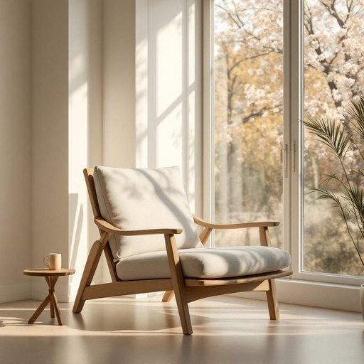

# chaise

<h1 style="font-size: 2.5em; font-weight: 300; letter-spacing: 2px; margin: 0; color: #2c3e50;">
/ʃeɪz/
</h1>

---

---

## 例句

After a long day at work, I love sinking into the chaise by the bay window, where the soft cushions and adjustable backrest provide the perfect combination of comfort and support, allowing me to read my favourite novel while basking in the afternoon sunlight.

*After(/ˈæftər/) a(/ə/) long(/lɔŋ/) day(/deɪ/) at(/æt/) work,(/wərk,/) I(/aɪ/) love(/ləv/) sinking(/ˈsɪŋkɪŋ/) into(/ˈɪntu/) the(/ðə/) chaise(/ʃeɪz/) by(/baɪ/) the(/ðə/) bay(/beɪ/) window,(/ˈwɪndoʊ,/) where(/wɛr/) the(/ðə/) soft(/sɔft/) cushions(/ˈkʊʃənz/) and(/ənd/) adjustable(/əˈʤəstəbəl/) backrest(/ˈbæˌkrɛst/) provide(/prəˈvaɪd/) the(/ðə/) perfect(/ˈpərˌfɪkt/) combination(/ˌkɑmbəˈneɪʃən/) of(/əv/) comfort(/ˈkəmfərt/) and(/ənd/) support,(/səˈpɔrt,/) allowing(/əˈlaʊɪŋ/) me(/mi/) to(/tɪ/) read(/rɛd/) my(/maɪ/) favourite(/ˈfeɪvərɪt/) novel(/ˈnɑvəl/) while(/waɪl/) basking(/ˈbæskɪŋ/) in(/ɪn/) the(/ðə/) afternoon(/ˌæftərˈnun/) sunlight.(/ˈsənˌlaɪt./)*

**翻译：** 忙碌一天后，我最喜欢沉浸在靠近飘窗的躺椅上，柔软的垫子和可调节的靠背完美结合，既舒适又有支撑，让我一边沐浴着午后阳光，一边静心阅读我最喜爱的小说。

---

## 解释

英语单词“chaise”作为家居生活用品中的名词，主要指一种带有靠背并可以半躺的长椅，常见于客厅、阳台或庭院，供人休憩、放松或阅读时使用，通常称为“chaise lounge”或“chaise longue”，但“chaise”自身即可表示这类长椅。学习者使用时需注意，chaise作为名词为可数名词，通常以单数或复数形式出现，其复数为“chaises”，常与表示方位、材料、颜色等的形容词搭配，例如“a comfortable chaise”，“a wooden chaise”。此外，“chaise”多用于书面或正式语境，口语中可能更偏好“lounger”或“daybed”等表达。词源方面，“chaise”源自法语，原意指“椅子”，来源于拉丁语“cathedra”，意指带靠背的椅子，后特指可躺的长椅，体现了欧洲贵族生活中对休闲家具的需求和审美。在中文语境中，准确翻译为“长躺椅”或“贵妃椅”，侧重表达其可供半躺休息的功能和造型，与普通椅子区别明显。通常无褒贬含义，文化内涵多体现为优雅、舒适和休闲的生活氛围，是家居环境中体现品味和生活品质的家具之一。

---

<small style="color: #999; font-size: 0.9em;">2025-07-27 09:14:04</small>

