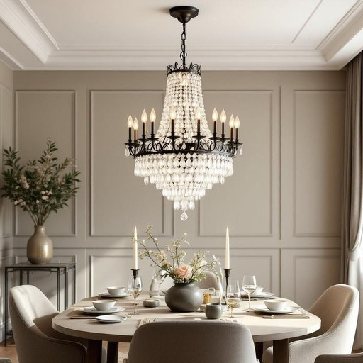

# chandelier

<h1 style="font-size: 2.5em; font-weight: 300; letter-spacing: 2px; margin: 0; color: #2c3e50;">
/ʃændəˈlɪr/
</h1>

---

---

## 例句

The chandelier, which had been handed down through three generations and featured intricate crystal droplets that caught the light beautifully, served not only as the main source of illumination in the dining room but also as a stunning centerpiece that sparked countless conversations during family gatherings.

*The(/ðə/) chandelier,(/ʃændəˈlɪr,/) which(/wɪʧ/) had(/hæd/) been(/bɪn/) handed(/ˈhændɪd/) down(/daʊn/) through(/θru/) three(/θri/) generations(/ˌʤɛnərˈeɪʃənz/) and(/ənd/) featured(/ˈfiʧərd/) intricate(/ˈɪntrəkət/) crystal(/ˈkrɪstəl/) droplets(/ˈdrɑpləts/) that(/ðət/) caught(/kɔt/) the(/ðə/) light(/laɪt/) beautifully,(/ˈbjutəfli,/) served(/sərvd/) not(/nɑt/) only(/ˈoʊnli/) as(/ɛz/) the(/ðə/) main(/meɪn/) source(/sɔrs/) of(/əv/) illumination(/ˌɪˌluməˈneɪʃən/) in(/ɪn/) the(/ðə/) dining(/ˈdaɪnɪŋ/) room(/rum/) but(/bət/) also(/ˈɔlsoʊ/) as(/ɛz/) a(/ə/) stunning(/ˈstənɪŋ/) centerpiece(/ˈsɛntərˌpis/) that(/ðət/) sparked(/spɑrkt/) countless(/ˈkaʊntləs/) conversations(/ˌkɑnvərˈseɪʃənz/) during(/ˈdʊrɪŋ/) family(/ˈfæməli/) gatherings.(/ˈgæðərɪŋz./)*

**翻译：** 这盏吊灯历经三代传承，装饰着精致的水晶滴，能够美妙地捕捉光线，不仅是餐厅的主要照明源，更成为令人赞叹的中心装饰，为家庭聚会带来了无数话题。

---

## 解释

“chandelier”作为名词，指的是一种豪华且通常悬挂于天花板上的装饰性吊灯，常见于客厅、餐厅、大厅等家居或公共场所，用于照明并起到装饰效果。在具体使用场合和语境中，chandelier多用于形容由多臂、多灯泡组成的复杂灯具，常见于正式或高档环境，表达一种典雅奢华的氛围。英语学习者在使用该词时，应注意其为可数名词，通常用单数形式指一个吊灯，复数形式为chandeliers；常见搭配包括“crystal chandelier”（水晶吊灯）、“antique chandelier”（古董吊灯）、“hang a chandelier”（悬挂吊灯）等，表达技巧上可用作修饰强调室内装饰风格的对象。此外，chandelier常与灯光明亮、空间华丽相关联。词源上，chandelier源自法语“chandelle”意为“蜡烛”，最初指用来悬挂蜡烛的灯具，随着照明技术发展，演变为专指装饰性吊灯。中文中，chandelier准确翻译为“吊灯”，强调其悬挂安装和装饰照明的功能，在家居生活用品的语境下通常无褒贬色彩，但因其华丽造型，往往暗示奢华和高档次的生活氛围。文化上，吊灯经常代表一种优雅、高贵和庄重，因此在描述室内设计时使用“chandelier”往往带有提升空间品味的正面含义。

---

<small style="color: #999; font-size: 0.9em;">2025-07-27 09:14:04</small>

