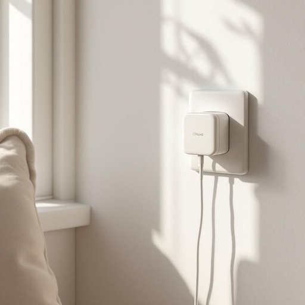

# charger

<h1 style="font-size: 2.5em; font-weight: 300; letter-spacing: 2px; margin: 0; color: #2c3e50;">
/ˈʧɑrʤər/
</h1>

---

---

## 例句

The charger’s tangled cables and faint label, usually plugged into the living room socket by the window, became essential equipment for completing the urgent emails before dinner as the phone’s battery rapidly depleted.

*The(/ðə/) charger’s(/charger’s*/) tangled(/ˈtæŋgəld/) cables(/ˈkeɪbəlz/) and(/ənd/) faint(/feɪnt/) label,(/ˈleɪbəl,/) usually(/ˈjuʒəwəli/) plugged(/pləgd/) into(/ˈɪntu/) the(/ðə/) living(/ˈlɪvɪŋ/) room(/rum/) socket(/ˈsɑkət/) by(/baɪ/) the(/ðə/) window,(/ˈwɪndoʊ,/) became(/bɪˈkeɪm/) essential(/ɛˈsɛnʃəl/) equipment(/ɪkˈwɪpmənt/) for(/fər/) completing(/kəmˈplitɪŋ/) the(/ðə/) urgent(/ˈərʤənt/) emails(/iˈmeɪlz/) before(/ˌbiˈfɔr/) dinner(/ˈdɪnər/) as(/ɛz/) the(/ðə/) phone’s(/phone’s*/) battery(/ˈbætəri/) rapidly(/ˈræpədli/) depleted.(/dɪˈplitɪd./)*

**翻译：** 充电器那纠缠在一起的线缆和隐约可见的标签，通常插在窗边客厅的插座上，成为晚餐前完成紧急邮件的必备装备，因为手机电量迅速耗尽。

---

## 解释

英语单词“charger”在家居生活用品的语境中作为名词，通常指用于给电子设备如手机、平板电脑、笔记本电脑和其他充电电池等供电以恢复电量的装置，这种设备通常插入电源插座，通过电线连接待充电设备。具体使用场合多见于家庭环境中为移动电子设备充电，或办公室、公共场所所用的充电设备。英语学习者需要注意，“charger”作为名词时通常是可数名词，复数形式为“chargers”，常见搭配有“phone charger（手机充电器）”、“battery charger（电池充电器）”、“wireless charger（无线充电器）”等，使用时常与动词“plug in”（插入电源）、“charge”（充电）搭配，如“plug in the charger to charge the phone”。此外，“charger”一词还有马具、战马的意义，但在家居生活用品领域，通常不会混淆。词源上，“charger”来自中古英语，原指“大盘子、大碟子”，源自古法语“chargier”，意为“装载”，后来引申为“负载电能的设备”，因装载电能而得名。在中文环境中，“charger”应被准确翻译为“充电器”，强调其为电子设备提供电力的功能，不宜混淆为其他含义。此词在家用语境中没有特殊褒贬色彩，属中性词汇，常用而且非常实用，是现代生活中不可或缺的电子配件名称。

---

<small style="color: #999; font-size: 0.9em;">2025-07-27 09:14:04</small>

