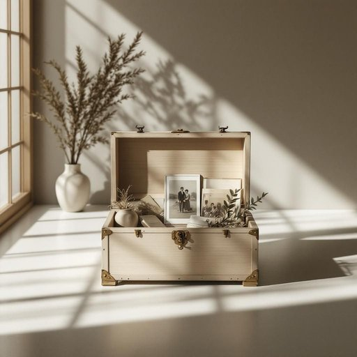

# chest

<h1 style="font-size: 2.5em; font-weight: 300; letter-spacing: 2px; margin: 0; color: #2c3e50;">
/ʧɛst/
</h1>

---

---

## 例句

After sorting through the old photographs and letters, she decided to place the fragile keepsakes carefully inside the antique wooden chest, which, despite its worn exterior and creaking hinges, had been a cherished family heirloom passed down through generations.

*After(/ˈæftər/) sorting(/ˈsɔrtɪŋ/) through(/θru/) the(/ðə/) old(/oʊld/) photographs(/ˈfoʊtəˌgræfs/) and(/ənd/) letters,(/ˈlɛtərz,/) she(/ʃi/) decided(/ˌdɪˈsaɪdɪd/) to(/tɪ/) place(/pleɪs/) the(/ðə/) fragile(/ˈfræʤəl/) keepsakes(/ˈkipˌseɪks/) carefully(/ˈkɛrfəli/) inside(/ˌɪnˈsaɪd/) the(/ðə/) antique(/ænˈtik/) wooden(/ˈwʊdən/) chest,(/ʧɛst,/) which,(/wɪʧ,/) despite(/dɪˈspaɪt/) its(/ɪts/) worn(/wɔrn/) exterior(/ɪkˈstɪriər/) and(/ənd/) creaking(/ˈkrikɪŋ/) hinges,(/ˈhɪnʤɪz,/) had(/hæd/) been(/bɪn/) a(/ə/) cherished(/ˈʧɛrɪʃt/) family(/ˈfæməli/) heirloom(/ˈɛˌrlum/) passed(/pæst/) down(/daʊn/) through(/θru/) generations.(/ˌʤɛnərˈeɪʃənz./)*

**翻译：** 在整理那些旧照片和信件后，她决定将这些脆弱的纪念品小心地安放在那只古老的木箱里。尽管木箱外表斑驳，铰链吱吱作响，但它却是一件珍贵的家传之宝，世代相传。

---

## 解释

在家居生活用品的语境中，英语单词"chest"作为名词通常指用于储存物品的大型有盖箱子或柜子，如储物箱、衣箱或木箱，常见于卧室或客厅，用于收纳衣物、被褥或其他家庭用品。具体使用场合包括描述家具、组织家庭空间或搬家打包时，例如"a chest of drawers"意为抽屉柜，"a storage chest"指储物箱。英语学习者在使用"chest"时需注意其单数与复数形式"chests"，以及与用途或位置相关的常见搭配，如"chest of drawers"（带抽屉的柜子）和"treasure chest"（宝箱，带有较强的文化色彩，多用于童话或历史语境）。此外，"chest"在语法上主要作可数名词，且在指代身体部位时需要区别，如"chest"也可表示“胸部”，但在家居用品语境中则完全不同，需根据上下文区分。词源上，"chest"源自古英语"cest"或"cist"，借自拉丁语"cista"，意为箱子或盒子，反映了该词自古代起即被用作存储容器的含义。中文语境中，"chest"常准确翻译为“箱子”或“柜子”，根据具体形态和用途可译为“衣柜”、“储物箱”或“抽屉柜”，理解时应结合家具类别和具体应用场合。需要注意的是，在家庭生活中"chest"一般无褒贬含义，但在文化表达中，如“宝箱”，带有神秘和珍贵的象征意义，体现某些西方文化的典型意象或故事元素。

---

<small style="color: #999; font-size: 0.9em;">2025-07-27 09:14:04</small>

