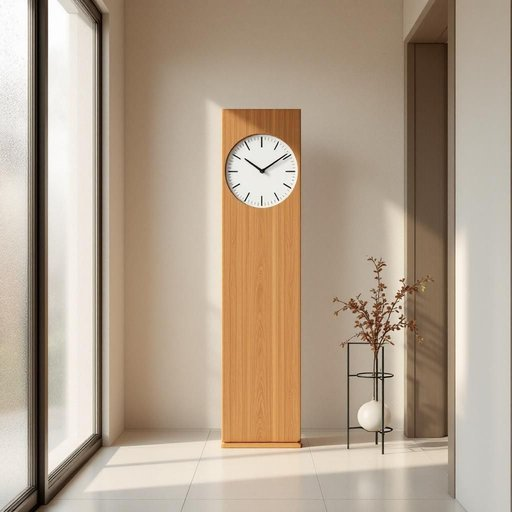

# chime

<h1 style="font-size: 2.5em; font-weight: 300; letter-spacing: 2px; margin: 0; color: #2c3e50;">
/ʧaɪm/
</h1>

---

---

## 例句

I always find the gentle chime of the grandfather clock in the hallway particularly soothing in the evening, especially when it blends with the soft hum of the kettle boiling in the kitchen and the distant murmur of the rain against the windowpane.

*I(/aɪ/) always(/ˈɔlˌweɪz/) find(/faɪnd/) the(/ðə/) gentle(/ˈʤɛnəl/) chime(/ʧaɪm/) of(/əv/) the(/ðə/) grandfather(/ˈgrænˌfɑðər/) clock(/klɑk/) in(/ɪn/) the(/ðə/) hallway(/ˈhɔlˌweɪ/) particularly(/ˌpɑrˈtɪkjələrli/) soothing(/ˈsuðɪŋ/) in(/ɪn/) the(/ðə/) evening,(/ˈivnɪŋ,/) especially(/əˈspɛʃəli/) when(/wɪn/) it(/ɪt/) blends(/blɛndz/) with(/wɪθ/) the(/ðə/) soft(/sɔft/) hum(/həm/) of(/əv/) the(/ðə/) kettle(/ˈkɛtəl/) boiling(/ˈbɔɪlɪŋ/) in(/ɪn/) the(/ðə/) kitchen(/ˈkɪʧən/) and(/ənd/) the(/ðə/) distant(/ˈdɪstənt/) murmur(/ˈmərmər/) of(/əv/) the(/ðə/) rain(/reɪn/) against(/əˈgɛnst/) the(/ðə/) windowpane.(/ˈwɪndoʊˌpeɪn./)*

**翻译：** 我总觉得走廊里那座落地钟在傍晚时分轻柔的钟声格外令人心安，尤其是当它与厨房中水壶沸腾时的低吟声以及窗玻璃上雨水轻轻拍打的远远呢喃交织在一起时。

---

## 解释

chime作为名词，在家居生活用品场景中通常指钟声、铃声或风铃发出的悦耳声音，具体是装置中产生的报时声音或装饰性响铃。常见使用场合包括挂钟、门铃、风铃等，这些装置通过chimes提醒时间或来访者，也有装饰居室、营造氛围的作用。英语学习者需注意，chime作为名词多用复数形式chimes表示连续的钟声或铃声，如the chimes of the clock，单数形式通常指单一音调或声音。常见搭配有door chime（门铃）、wind chime（风铃）和melodious chimes（悦耳的钟声）。词源方面，chime源自中古英语chimen或chemen，可能与法语cheminer（沿路行进）有关，最早指在教堂钟楼传递信号的钟声，后延伸至其他类似声音装置。中文翻译通常为“钟声”、“铃声”或“风铃声”，在家居语境中指用来报时、提示或装饰的响铃声，强调其清脆、和谐的音质，无褒贬色彩，属中性词汇，体现了西方日常生活中通过声音与环境互动的文化细节。

---

<small style="color: #999; font-size: 0.9em;">2025-07-27 09:14:04</small>

