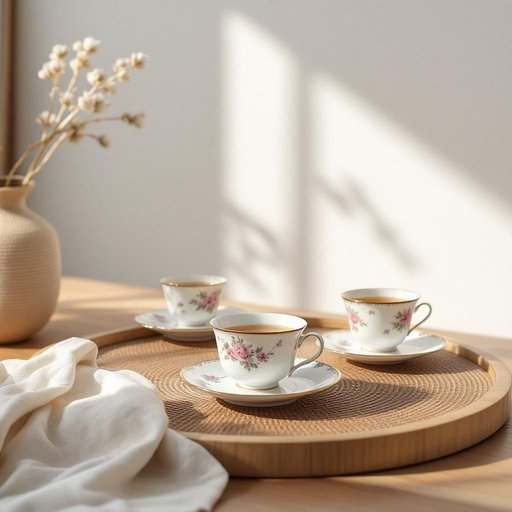

# china

<h1 style="font-size: 2.5em; font-weight: 300; letter-spacing: 2px; margin: 0; color: #2c3e50;">
/ˈʧaɪnə/
</h1>

---

---

## 例句

Could you please arrange the shipment of the fragile china, especially the vintage tea set known for its intricate floral patterns, and the porcelain plates that Grandma treasured, before we relocate to the new house next weekend?

*Could(/kʊd/) you(/ju/) please(/pliz/) arrange(/əreɪnʤ/) the(/ðə/) shipment(/ˈʃɪpmənt/) of(/əv/) the(/ðə/) fragile(/ˈfræʤəl/) china,(/ˈʧaɪnə,/) especially(/əˈspɛʃəli/) the(/ðə/) vintage(/ˈvɪntɪʤ/) tea(/ti/) set(/sɛt/) known(/noʊn/) for(/fər/) its(/ɪts/) intricate(/ˈɪntrəkət/) floral(/ˈflɔrəl/) patterns,(/ˈpætərnz,/) and(/ənd/) the(/ðə/) porcelain(/ˈpɔrsələn/) plates(/pleɪts/) that(/ðət/) Grandma(/ˈgrændmɑ/) treasured,(/ˈtrɛʒərd,/) before(/ˌbiˈfɔr/) we(/wi/) relocate(/ˌriˈloʊkeɪt/) to(/tɪ/) the(/ðə/) new(/nu/) house(/haʊs/) next(/nɛkst/) weekend?(/ˈwiˌkɪnd?/)*

**翻译：** 请您在我们下周末搬入新居之前，安排易碎瓷器的运输，尤其是那套以精美花卉图案著称的古董茶具，以及奶奶珍爱的瓷盘。

---

## 解释

china作为名词在家居生活用品的语境中，通常指的是瓷器或瓷制餐具，比如茶具、盘子、碟子等，使用场合多见于餐桌布置、厨房用品描述或家庭装饰中。英语学习者应注意，china在此含义下一般作不可数名词使用，但有时也可用于复数形式fine china指高档瓷器，且常见搭配有fine china（精美瓷器）、china set（瓷器套装）、bone china（骨瓷）等。在语法上，china作为物质名词，不能直接指人或动物，且通常与形容词连用强调质地或品质。该词源自对中国瓷器品质的赞誉，起初china一词即指代源自中国的瓷器，是西方对中国制造陶瓷器具的统称，体现了该物品的历史文化背景。在中文语境中，china对应的准确翻译是瓷器或瓷制餐具，特别指那些精致、适合正式饭桌使用的瓷质器皿。需要注意的是，china并不泛指所有陶瓷制品，而是强调瓷质材料的精细和高雅，且在英语中无特殊褒贬色彩，但在文化上常隐含高质量和传统手工艺的褒义。

---

<small style="color: #999; font-size: 0.9em;">2025-07-27 09:14:04</small>

