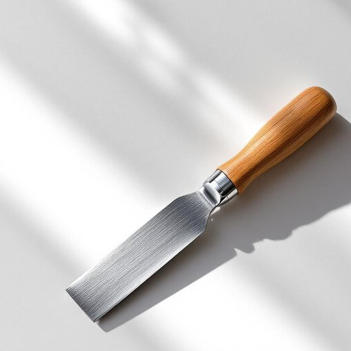

# chisel

<h1 style="font-size: 2.5em; font-weight: 300; letter-spacing: 2px; margin: 0; color: #2c3e50;">
/ˈʧɪzəl/
</h1>

---

---

## 例句

The committee, whose diverse members debated the proposal vigorously during the prolonged meeting that extended well into the evening, finally reached a unanimous decision that would significantly impact the future development of the community park.

*The(/ðə/) committee,(/kəˈmɪti,/) whose(/huz/) diverse(/dɪˈvərs/) members(/ˈmɛmbərz/) debated(/dəˈbeɪtɪd/) the(/ðə/) proposal(/prəˈpoʊzəl/) vigorously(/ˈvɪgərəsli/) during(/ˈdʊrɪŋ/) the(/ðə/) prolonged(/prəˈlɔŋd/) meeting(/ˈmitɪŋ/) that(/ðət/) extended(/ɪkˈstɛndɪd/) well(/wɛl/) into(/ˈɪntu/) the(/ðə/) evening,(/ˈivnɪŋ,/) finally(/ˈfaɪnəli/) reached(/riʧt/) a(/ə/) unanimous(/juˈnænəməs/) decision(/dɪˈsɪʒən/) that(/ðət/) would(/wʊd/) significantly(/sɪgˈnɪfɪkəntli/) impact(/ˌɪmˈpækt/) the(/ðə/) future(/fˈjuʧər/) development(/dɪˈvɛləpmənt/) of(/əv/) the(/ðə/) community(/kəmˈjunɪti/) park.(/pɑrk./)*

**翻译：** 委员会成员背景多样，在持续到深夜的长时间会议中针对该提案展开了激烈讨论，最终一致作出决定，这一决定将对社区公园的未来发展产生重大影响。

---

## 解释

英语单词“chisel”作为名词在家居生活用品的语境中，通常指一种用于雕刻、凿除木材、石材或金属的手工工具，即凿子。这类工具一般由坚硬的钢制刀刃和坚固的手柄组成，使用时通过锤击刀口边缘或直接用手推，将材料的表面剔除或雕刻成所需形状。英语学习者在使用“chisel”时需注意，它为可数名词，常见的搭配有“一把凿子和锤子”或“木雕凿子”，此外，动词形式“to chisel”意为用凿子凿刻，有时也引申为“欺骗、狡猾地获取”，需根据上下文判断词义。该词源自中古英语，借自古法语“cisel”，最终起源于拉丁语“cisellum”，意为切割工具，反映了工具的功能性和历史沿革。在中文语境中，“chisel”准确翻译为“凿子”，是一种常见的手工工具名词，整体含义中性，无褒贬色彩，使用时需注意其具体用法和工具性质，便于准确理解和应用。

---

<small style="color: #999; font-size: 0.9em;">2025-07-27 09:14:04</small>

