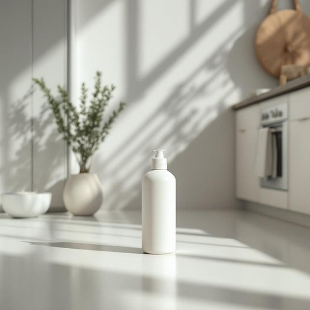

# cleaner

<h1 style="font-size: 2.5em; font-weight: 300; letter-spacing: 2px; margin: 0; color: #2c3e50;">
/ˈklinər/
</h1>

---

---

## 例句

Whenever the kitchen floor looks particularly grimy after a busy weekend, I reach for the cleaner that’s specially formulated to tackle stubborn grease and stains, making the whole space feel fresh and inviting without leaving any harsh chemical residue.

*Whenever(/wɛˈnɛvər/) the(/ðə/) kitchen(/ˈkɪʧən/) floor(/flɔr/) looks(/lʊks/) particularly(/ˌpɑrˈtɪkjələrli/) grimy(/ˈgraɪmi/) after(/ˈæftər/) a(/ə/) busy(/ˈbɪzi/) weekend,(/ˈwiˌkɪnd,/) I(/aɪ/) reach(/riʧ/) for(/fər/) the(/ðə/) cleaner(/ˈklinər/) that’s(/that’s*/) specially(/ˈspɛʃəli/) formulated(/ˈfɔrmjəˌleɪtɪd/) to(/tɪ/) tackle(/ˈtækəl/) stubborn(/ˈstəbərn/) grease(/gris/) and(/ənd/) stains,(/steɪnz,/) making(/ˈmeɪkɪŋ/) the(/ðə/) whole(/hoʊl/) space(/speɪs/) feel(/fil/) fresh(/frɛʃ/) and(/ənd/) inviting(/ˌɪnˈvaɪtɪŋ/) without(/wɪˈθaʊt/) leaving(/ˈlivɪŋ/) any(/ˈɛni/) harsh(/hɑrʃ/) chemical(/ˈkɛmɪkəl/) residue.(/ˈrɛzəˌdu./)*

**翻译：** 每当厨房地板在繁忙的周末后显得格外脏乱时，我都会使用那款专门针对顽固油渍和污渍研制的清洁剂，让整个空间焕然一新，清新宜人，同时不会留下任何刺激性的化学残留。

---

## 解释

英语单词"cleaner"在家居生活用品的语境中作为名词，通常指用于清洁各种表面或物品的清洁剂或清洁工具，如地板清洁剂、玻璃清洁剂、家具清洁剂等，具体使用场合包括厨房、浴室、客厅等需要清除污渍、灰尘或油渍的地方。英语学习者在使用"cleaner"时需注意其作为名词时通常表示“清洁剂”或“清洁工具”，而不是指“清洁工人”，后者常用复数形式"cleaners"或专门词汇“cleaning staff”；此外，该词为可数名词，常见搭配有“window cleaner”（窗户清洁剂/工人）、“floor cleaner”（地板清洁剂）、“car cleaner”（汽车清洁剂）等，表达时需根据具体语境区分，而当指代清洁剂时往往与形容词连用以说明用途，如“bathroom cleaner”（浴室清洁剂）。词源方面，“cleaner”来自动词“clean”加上名词后缀“-er”，意指“使……变清洁的物品或人”，起初主要表示“清洁工人”，后来随着家居产品多样化也用于指代各种清洁剂或相关工具。在中文语境中，"cleaner"可准确翻译为“清洁剂”或“清洁用品”，根据具体语境也可能译为“清洁工”，但在家居用品领域多指“清洁剂”，强调其功能性，没有特别的褒贬含义或文化色彩，属于中性词汇。

---

<small style="color: #999; font-size: 0.9em;">2025-07-27 09:14:04</small>

