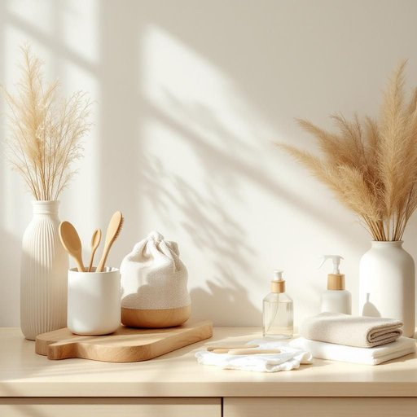

# cleaning

<h1 style="font-size: 2.5em; font-weight: 300; letter-spacing: 2px; margin: 0; color: #2c3e50;">
/ˈklinɪŋ/
</h1>

---

---

## 例句

Despite the fact that the cleaning, which includes everything from dusting the shelves to scrubbing the kitchen floor, always takes up a good portion of my Saturday morning, I find that using eco-friendly products not only makes the process less harsh on my skin but also leaves the whole house smelling fresher and more inviting.

*Despite(/dɪˈspaɪt/) the(/ðə/) fact(/fækt/) that(/ðət/) the(/ðə/) cleaning,(/ˈklinɪŋ,/) which(/wɪʧ/) includes(/ˌɪnˈkludz/) everything(/ˈɛvriˌθɪŋ/) from(/frəm/) dusting(/ˈdəstɪŋ/) the(/ðə/) shelves(/ʃɛlvz/) to(/tɪ/) scrubbing(/ˈskrəbɪŋ/) the(/ðə/) kitchen(/ˈkɪʧən/) floor,(/flɔr,/) always(/ˈɔlˌweɪz/) takes(/teɪks/) up(/əp/) a(/ə/) good(/gʊd/) portion(/ˈpɔrʃən/) of(/əv/) my(/maɪ/) Saturday(/ˈsæˌtɪˌdeɪ/) morning,(/ˈmɔrnɪŋ,/) I(/aɪ/) find(/faɪnd/) that(/ðət/) using(/ˈjuzɪŋ/) eco-friendly(/eco-friendly*/) products(/ˈprɑdəkts/) not(/nɑt/) only(/ˈoʊnli/) makes(/meɪks/) the(/ðə/) process(/ˈprɔˌsɛs/) less(/lɛs/) harsh(/hɑrʃ/) on(/ɔn/) my(/maɪ/) skin(/skɪn/) but(/bət/) also(/ˈɔlsoʊ/) leaves(/livz/) the(/ðə/) whole(/hoʊl/) house(/haʊs/) smelling(/sˈmɛlɪŋ/) fresher(/ˈfrɛʃər/) and(/ənd/) more(/mɔr/) inviting.(/ˌɪnˈvaɪtɪŋ./)*

**翻译：** 尽管清洁工作——从擦拭书架上的灰尘到刷洗厨房地板——总是占据我周六上午的大部分时间，但我发现使用环保产品不仅让清洁过程对我的皮肤更加温和，还使整个房子闻起来更加清新宜人。

---

## 解释

英语单词“cleaning”作为名词在家居生活用品场景中指的是清洁活动或清洁工作，通常用来描述打扫、擦拭、洗涤等保持环境整洁的具体行为或过程，例如“the cleaning of the house”（房子的清洁工作）或“window cleaning”（擦窗户）。使用时，“cleaning”多出现在不可数名词的用法中，通常不直接用复数形式，且常与冠词the连用或作不可数名词单独使用，表达整体的清洁任务或过程；在语法搭配方面，常见的搭配有动词do cleaning（进行清洁）、professional cleaning services（专业清洁服务）以及形容词heavy cleaning（大扫除）、regular cleaning（定期清洁）等，学习者需注意“cleaning”虽源自动词“clean”，但作为名词时不可直接视为可数名词，且不可与复数形式连用。词源方面，“cleaning”源自动词“clean”，该词源自古英语“clǣne”，意为干净，后加上动名词词尾“-ing”形成表示动作或过程的名词，体现了语言中由动词转化为名词以描述行为的常见模式。在中文语境中，“cleaning”准确对应于“清洁”、“打扫”或“清扫”，该词通常不含褒贬意义，属于中性词汇，且在实际使用中侧重于动作或过程本身而非结果，文化上反映了西方社会对居住环境卫生的重视和规范。总的来说，“cleaning”作为名词在家庭生活中强调日常的清洁过程，用法规范且通用，适合各类描述打扫整理的场景。

---

<small style="color: #999; font-size: 0.9em;">2025-07-27 09:14:04</small>

