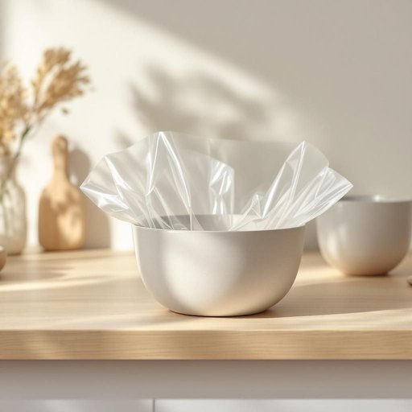

# clingfilm

<h1 style="font-size: 2.5em; font-weight: 300; letter-spacing: 2px; margin: 0; color: #2c3e50;">
/clingfilm*/
</h1>

---

---

## 例句

Before you pop the leftovers into the fridge, could you please cover the bowl tightly with some clingfilm, the one from the roll in the top drawer, so it stays fresh and doesn’t absorb any odors from the other food?

*Before(/ˌbiˈfɔr/) you(/ju/) pop(/pɑp/) the(/ðə/) leftovers(/ˈlɛfˌtoʊvərz/) into(/ˈɪntu/) the(/ðə/) fridge,(/frɪʤ,/) could(/kʊd/) you(/ju/) please(/pliz/) cover(/ˈkəvər/) the(/ðə/) bowl(/boʊl/) tightly(/ˈtaɪtli/) with(/wɪθ/) some(/səm/) clingfilm,(/clingfilm*,/) the(/ðə/) one(/wən/) from(/frəm/) the(/ðə/) roll(/roʊl/) in(/ɪn/) the(/ðə/) top(/tɔp/) drawer,(/drɔr,/) so(/soʊ/) it(/ɪt/) stays(/steɪz/) fresh(/frɛʃ/) and(/ənd/) doesn’t(/doesn’t*/) absorb(/əbˈzɔrb/) any(/ˈɛni/) odors(/ˈoʊdərz/) from(/frəm/) the(/ðə/) other(/ˈəðər/) food?(/fud?/)*

**翻译：** 在你把剩饭放进冰箱之前，能否请你用顶层抽屉里那卷保鲜膜把碗盖紧，这样食物能保持新鲜，不会吸收其他食物的气味？

---

## 解释

clingfilm作为名词在家居生活用品场景中指的是一种透明、有粘性的塑料薄膜，常用于包裹食物以保鲜、防止异味散发或防止水分流失，典型使用场合包括包裹剩饭剩菜、水果或蔬菜等；在英语语境中，clingfilm通常与动词短语“wrap something in clingfilm”搭配使用，比如“wrap the sandwich in clingfilm”，学习者需要注意的是该词是不可数名词，不用复数形式，也常见于不可数量词的表达中。词源上，clingfilm由单词“cling”（紧贴、附着）和“film”（薄膜）组合而成，形象地描述了这种薄膜紧密贴合物体表面的特性。中文环境中，clingfilm通常翻译为“保鲜膜”或“保鲜塑料薄膜”，强调其在保存食物新鲜方面的功能，需避免与“塑料膜”泛指混淆，在日常生活中此词中性无褒贬含义，也不带特殊文化色彩，属于普遍常见的家用物品名称。

---

<small style="color: #999; font-size: 0.9em;">2025-07-27 09:14:04</small>

