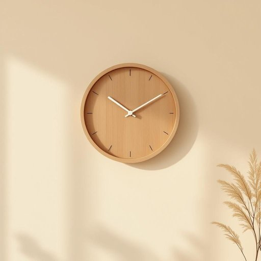

# clock

<h1 style="font-size: 2.5em; font-weight: 300; letter-spacing: 2px; margin: 0; color: #2c3e50;">
/klɑk/
</h1>

---

---

## 例句

Could you please check the clock in the living room, which has that ornate wooden frame and the ticking sound that I find strangely comforting, to see if it’s still showing the correct time before we start preparing dinner?

*Could(/kʊd/) you(/ju/) please(/pliz/) check(/ʧɛk/) the(/ðə/) clock(/klɑk/) in(/ɪn/) the(/ðə/) living(/ˈlɪvɪŋ/) room,(/rum,/) which(/wɪʧ/) has(/həz/) that(/ðət/) ornate(/ɔrˈneɪt/) wooden(/ˈwʊdən/) frame(/freɪm/) and(/ənd/) the(/ðə/) ticking(/ˈtɪkɪŋ/) sound(/saʊnd/) that(/ðət/) I(/aɪ/) find(/faɪnd/) strangely(/ˈstreɪnʤli/) comforting,(/ˈkəmfərtɪŋ,/) to(/tɪ/) see(/si/) if(/ɪf/) it’s(/it’s*/) still(/stɪl/) showing(/ʃoʊɪŋ/) the(/ðə/) correct(/kərˈɛkt/) time(/taɪm/) before(/ˌbiˈfɔr/) we(/wi/) start(/stɑrt/) preparing(/pərˈpɛrɪŋ/) dinner?(/ˈdɪnər?/)*

**翻译：** 你能帮忙看看客厅里那只带有华丽木质边框、发出让我觉得异常安慰的滴答声的钟吗？在我们开始准备晚餐之前，确认它显示的时间是否仍然准确。

---

## 解释

“clock”作为名词在家居生活用品的英语场景中，主要指用来显示时间的装置，如挂钟、座钟或闹钟，常见于客厅、卧室、厨房等家庭环境。具体使用场合包括描述时间，如“The clock on the wall shows three o’clock”（墙上的钟显示三点钟），或说“set the alarm clock”（设置闹钟）。英语学习者在使用“clock”时需注意，它是可数名词，复数形式为“clocks”，且常与表示方位的词连用，如“wall clock”（挂钟）、“alarm clock”（闹钟）、“mantel clock”（壁炉架钟）等；此外，表达整点时间时常用“o’clock”结构，如“five o’clock”，表示整点。语法上“clock”可作为主语、宾语使用，且常搭配动词“set”、“look at”或短语“go off”（闹钟响）。词源方面，“clock”源自中世纪拉丁语“clocca”，意为“钟”，传入英语后逐渐指代机械计时装置。中文语境中，“clock”准确翻译为“钟”或“时钟”，涵盖挂钟、座钟、闹钟等家用计时器，强调其显示时间的功能。该词在日常生活中属中性词汇，无褒贬含义，也无特殊文化色彩，是描述家居定时和时间管理的常用词。

---

<small style="color: #999; font-size: 0.9em;">2025-07-27 09:14:04</small>

