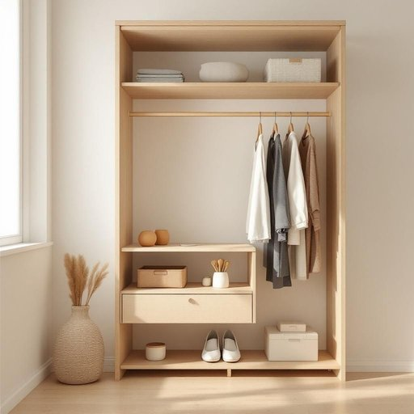

# closet

<h1 style="font-size: 2.5em; font-weight: 300; letter-spacing: 2px; margin: 0; color: #2c3e50;">
/ˈklɑzət/
</h1>

---

---

## 例句

After years of dedicated research, the scientist's hypothesis became a groundbreaking discovery that revolutionized the entire field of physics.

*After(/ˈæftər/) years(/jɪrz/) of(/əv/) dedicated(/ˈdɛdəkeɪtəd/) research,(/ˈrisərʧ,/) the(/ðə/) scientist's(/ˈsaɪəntɪsts/) hypothesis(/haɪˈpɑθəsəs/) became(/bɪˈkeɪm/) a(/ə/) groundbreaking(/ˈgraʊnˌbreɪkɪŋ/) discovery(/ˌdɪˈskəvri/) that(/ðət/) revolutionized(/ˌrɛvəˈluʃəˌnaɪzd/) the(/ðə/) entire(/ɪnˈtaɪər/) field(/fild/) of(/əv/) physics.(/ˈfɪzɪks./)*

**翻译：** 经过多年的潜心研究，这位科学家的假说终于成为了一项划时代的发现，彻底革新了整个物理学领域。

---

## 解释

英语单词“closet”作为名词在家居生活用品语境中，指的是家中用来存放衣物、日常用品或杂物的小型封闭储藏空间，通常内设挂衣杆和搁板，类似中文中的“壁橱”或“储藏柜”。具体使用场合多在描述房间布局、整理储物或居家环境时，如“a bedroom closet”（卧室的壁橱）或“a linen closet”（储放床单、毛巾的柜子）。英语学习者需要注意“closet”作为可数名词时，常用复数形式“closets”，且前面一般用冠词如a、the，搭配的动词需保持单复数一致。此外，常见搭配有“walk-in closet”（步入式衣帽间）、“closet door”（壁橱门）等，表达时应注意与家居环境紧密关联。词源上，“closet”源自中古英语“closet”，最初意为“密室”或“私人小房间”，其根源可追溯至拉丁语“clausum”，意指“关闭”或“封闭的地方”，体现其封闭储藏的功能。在中文语境中，准确翻译为“壁橱”、“衣柜”或“小储藏室”，根据实际用途有所区别，不同于大型衣柜或开放式储物空间。需要注意的是，“closet”在某些文化背景下可能引申为“隐秘的”如“closet gay”（隐秘同性恋者），具有特殊语言色彩，但在家居用品语境下无此含义，使用时应根据上下文区分。整体而言，“closet”作为家居名词使用时是一种中性、普遍的词汇，表达储物功能明确，使用简洁规范即可。

---

<small style="color: #999; font-size: 0.9em;">2025-07-27 09:14:04</small>

