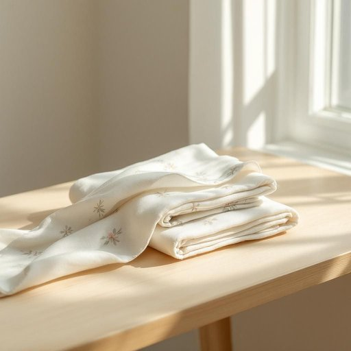

# cloth

<h1 style="font-size: 2.5em; font-weight: 300; letter-spacing: 2px; margin: 0; color: #2c3e50;">
/klɔθ/
</h1>

---

---

## 例句

Could you please pass me the cloth that’s folded next to the window, the one with the subtle floral pattern and slightly rough texture, so I can wipe down the kitchen counter before preparing dinner?

*Could(/kʊd/) you(/ju/) please(/pliz/) pass(/pæs/) me(/mi/) the(/ðə/) cloth(/klɔθ/) that’s(/that’s*/) folded(/ˈfoʊldɪd/) next(/nɛkst/) to(/tɪ/) the(/ðə/) window,(/ˈwɪndoʊ,/) the(/ðə/) one(/wən/) with(/wɪθ/) the(/ðə/) subtle(/ˈsətəl/) floral(/ˈflɔrəl/) pattern(/ˈpætərn/) and(/ənd/) slightly(/sˈlaɪtli/) rough(/rəf/) texture,(/ˈtɛksʧər,/) so(/soʊ/) I(/aɪ/) can(/kən/) wipe(/waɪp/) down(/daʊn/) the(/ðə/) kitchen(/ˈkɪʧən/) counter(/ˈkaʊntər/) before(/ˌbiˈfɔr/) preparing(/pərˈpɛrɪŋ/) dinner?(/ˈdɪnər?/)*

**翻译：** 请您把窗边叠放的那块布递给我，是带有淡雅花纹且质地略显粗糙的那块，我想用它擦拭厨房台面，以便准备晚餐。

---

## 解释

英语单词“cloth”作为名词在家居生活用品的语境中，通常指用于制作衣物、家具覆盖物、窗帘、桌布等纺织品的布料。具体使用场合包括描述家中的布制品，如擦桌布、桌布、窗帘布等，常见于讨论家庭清洁、装饰或纺织材料时。英语学习者在使用“cloth”时需注意其不可数与可数形式的区别：多数情况下“cloth”指布料本身，作为不可数名词出现，而在特指不同块布料时可用复数形式“cloths”，但表具体布料种类时多用单数。同时，需区别“cloth”与“clothes”（表示衣服的复数名词）避免混淆；“cloth”强调材质，“clothes”指穿着的衣物。常见搭配有“cleaning cloth”（擦布）、“table cloth”（桌布）、“dust cloth”（抹布）等，表达时可搭配形容词修饰以具体指明用途或性质。词源方面，“cloth”源自古英语“clað”，意为布、衣服，其根源反映了纺织品作为人类基本生活用品的历史地位。中文语境中，“cloth”准确翻译为“布”或“布料”，用于指代纺织材料，而非具体成衣，需根据上下文灵活理解，有时可译为“布匹”或“布块”。该词本身无特殊褒贬色彩，属于中性词，文化内涵主要体现在其作为传统制造衣物和家用纺织品的基础材料的重要性。

---

<small style="color: #999; font-size: 0.9em;">2025-07-27 09:14:04</small>

