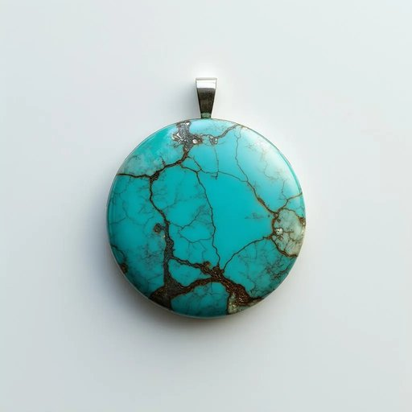

# coaster

<h1 style="font-size: 2.5em; font-weight: 300; letter-spacing: 2px; margin: 0; color: #2c3e50;">
/ˈkoʊstər/
</h1>

---

---

## 例句

Could you please pass me the coaster that is adorned with those delicate blue patterns from the dining table, since I want to avoid leaving any ring marks on the freshly polished wooden surface after placing my tea mug down?

*Could(/kʊd/) you(/ju/) please(/pliz/) pass(/pæs/) me(/mi/) the(/ðə/) coaster(/ˈkoʊstər/) that(/ðət/) is(/ɪz/) adorned(/əˈdɔrnd/) with(/wɪθ/) those(/ðoʊz/) delicate(/ˈdɛləkət/) blue(/blu/) patterns(/ˈpætərnz/) from(/frəm/) the(/ðə/) dining(/ˈdaɪnɪŋ/) table,(/ˈteɪbəl,/) since(/sɪns/) I(/aɪ/) want(/wɔnt/) to(/tɪ/) avoid(/əˈvɔɪd/) leaving(/ˈlivɪŋ/) any(/ˈɛni/) ring(/rɪŋ/) marks(/mɑrks/) on(/ɔn/) the(/ðə/) freshly(/ˈfrɛʃli/) polished(/ˈpɑlɪʃt/) wooden(/ˈwʊdən/) surface(/ˈsərfəs/) after(/ˈæftər/) placing(/ˈpleɪsɪŋ/) my(/maɪ/) tea(/ti/) mug(/məg/) down?(/daʊn?/)*

**翻译：** 请把餐桌上那个饰有精致蓝色图案的杯垫递给我好吗？我想在放下茶杯时避免在刚擦拭过的木质表面留下水渍。

---

## 解释

英语单词“coaster”在家居生活用品语境中作为名词，通常指放置杯子或饮料容器底部的小垫子，用以防止液体渗漏或热量直接接触桌面，保护家具表面不被损坏。具体使用场合如餐桌、茶几或办公桌上，当人们饮用水、茶或咖啡时，会将杯子放在coaster上以保持整洁和防止水渍。学习者使用该词时需注意其单数形式“coaster”和复数形式“coasters”的变化，以及常见搭配如“drink coaster”（饮料杯垫）、“wooden coaster”（木质杯垫）、“place a glass on a coaster”（把杯子放在杯垫上）等表达。此外，coaster本身也有其他含义，比如过山车或小船，但在家居用品语境中需根据上下文明确指代杯垫。该词源自“to coast”意为滑行，原指早期木制小推车上的滑轮，后来引申为护垫，因其形状和功能与“滑动”的保护垫有关。在中文中，coaster准确翻译为“杯垫”或“杯托”，强调其实用功能，即防止桌面被水杯或热饮损坏的垫子。这一词汇在中文语境中没有褒贬色彩，属于中性实用名词，且常出现在家居生活的日常用语中，反映现代人对生活品质和家具保护的重视。

---

<small style="color: #999; font-size: 0.9em;">2025-07-27 09:14:04</small>

