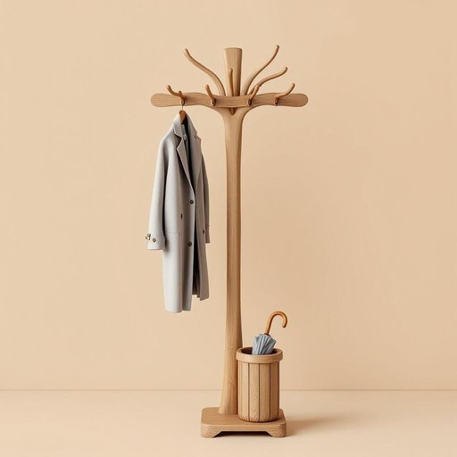

# coatrack

<h1 style="font-size: 2.5em; font-weight: 300; letter-spacing: 2px; margin: 0; color: #2c3e50;">
/coatrack*/
</h1>

---

---

## 例句

After coming in from the rain, she hurried to hang her dripping umbrella and heavy coat on the coatrack by the hallway, which was not only elegantly carved but also equipped with several sturdy hooks and a small umbrella stand at the base, ensuring everything stayed organized and off the floor.

*After(/ˈæftər/) coming(/ˈkəmɪŋ/) in(/ɪn/) from(/frəm/) the(/ðə/) rain,(/reɪn,/) she(/ʃi/) hurried(/ˈhərid/) to(/tɪ/) hang(/hæŋ/) her(/hər/) dripping(/ˈdrɪpɪŋ/) umbrella(/ˈəmˌbrɛlə/) and(/ənd/) heavy(/ˈhɛvi/) coat(/koʊt/) on(/ɔn/) the(/ðə/) coatrack(/coatrack*/) by(/baɪ/) the(/ðə/) hallway,(/ˈhɔlˌweɪ,/) which(/wɪʧ/) was(/wɑz/) not(/nɑt/) only(/ˈoʊnli/) elegantly(/ˈɛlɪgənˌtli/) carved(/kɑrvd/) but(/bət/) also(/ˈɔlsoʊ/) equipped(/ɪkˈwɪpt/) with(/wɪθ/) several(/ˈsɛvərəl/) sturdy(/ˈstərdi/) hooks(/hʊks/) and(/ənd/) a(/ə/) small(/smɔl/) umbrella(/ˈəmˌbrɛlə/) stand(/stænd/) at(/æt/) the(/ðə/) base,(/beɪs,/) ensuring(/ɪnˈʃʊrɪŋ/) everything(/ˈɛvriˌθɪŋ/) stayed(/steɪd/) organized(/ˈɔrgəˌnaɪzd/) and(/ənd/) off(/ɔf/) the(/ðə/) floor.(/flɔr./)*

**翻译：** 她从雨中进来后，匆忙地将滴水的伞和沉重的大衣挂在走廊旁那个不仅雕刻精美、还配备了几个结实挂钩和底部小雨伞架的衣帽架上，确保一切整齐有序，不落地面。

---

## 解释

英语单词“coatrack”作为名词，主要指家居生活中用来挂衣服、外套、帽子等物品的支架或架子，通常放置在入口处、玄关或卧室以方便收纳和整理。在具体使用场合上，当人们进入房间后常将外套挂在coatrack上，以保持空间整洁，避免衣物散乱；在描述家具配置时，常用该词表达某处有供挂衣服的设施。英语学习者在使用coatrack时需注意该词为可数名词，通常与形容词连用如“wooden coatrack”（木质衣帽架）、“freestanding coatrack”（独立式衣帽架），在句中既可作主语也可作宾语，搭配介词短语如“on the coatrack”（在衣帽架上）。此外，在表达多件挂物时，复数形式coatracks常见。该词源自“coat”（外套）和“rack”（架子）两个简单词的结合，具有合成词的特征，自身含义直白，无特殊隐喻或文化色彩，也无贬义或褒义，属于中性词汇。在中文语境中，“coatrack”通常准确翻译为“衣帽架”或“衣服架”，强调其功能属性，帮助学习者理解其用途和位置，从而在实际生活对话和描述家具时正确使用。

---

<small style="color: #999; font-size: 0.9em;">2025-07-27 09:14:04</small>

