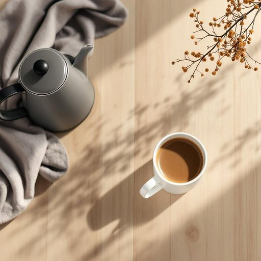

# coffee

<h1 style="font-size: 2.5em; font-weight: 300; letter-spacing: 2px; margin: 0; color: #2c3e50;">
/ˈkɔfi/
</h1>

---

---

## 例句

Could you please pass me the coffee that’s sitting next to the kettle on the counter, the one we bought last week from that new artisan shop, because I’d love to brew a fresh cup before we start tidying up the living room this afternoon?

*Could(/kʊd/) you(/ju/) please(/pliz/) pass(/pæs/) me(/mi/) the(/ðə/) coffee(/ˈkɔfi/) that’s(/that’s*/) sitting(/ˈsɪtɪŋ/) next(/nɛkst/) to(/tɪ/) the(/ðə/) kettle(/ˈkɛtəl/) on(/ɔn/) the(/ðə/) counter,(/ˈkaʊntər,/) the(/ðə/) one(/wən/) we(/wi/) bought(/bɔt/) last(/læst/) week(/wik/) from(/frəm/) that(/ðət/) new(/nu/) artisan(/ˈɑrtəzən/) shop,(/ʃɑp,/) because(/bɪˈkəz/) I’d(/i’d*/) love(/ləv/) to(/tɪ/) brew(/bru/) a(/ə/) fresh(/frɛʃ/) cup(/kəp/) before(/ˌbiˈfɔr/) we(/wi/) start(/stɑrt/) tidying(/tidying*/) up(/əp/) the(/ðə/) living(/ˈlɪvɪŋ/) room(/rum/) this(/ðɪs/) afternoon?(/ˌæftərˈnun?/)*

**翻译：** 请把放在柜台上水壶旁边的咖啡递给我，就是我们上周从那家新开的手工艺店买的那款，因为我想在我们下午开始整理客厅之前，先煮一杯新鲜的咖啡。

---

## 解释

英语单词“coffee”在家居生活用品场景中作为名词，主要指的是一种由咖啡豆研磨并用热水冲泡而成的饮品，通常在家庭厨房或餐桌上出现，适用于日常饮用、招待客人或早餐时饮用的场合。学习者在使用该词时需要注意，coffee属于不可数名词，表示物质或饮料内容时一般不加复数形式，但当指代“不同种类的咖啡”时可以用复数coffees。此外，“a cup of coffee”“some coffee”等常见搭配需要与量词连用以表达具体量；而“coffee maker”“coffee mug”等词组则属于常见搭配，帮助丰富表达。该词源自阿拉伯语“qahwa”，之后通过土耳其语“kahve”传入欧洲语言，最终形成现代英语的“coffee”，其起源反映了咖啡文化从中东向欧洲扩散的历史背景。在中文语境中，“coffee”一般准确翻译为“咖啡”，是一种普遍接受和深受喜爱的日常饮品，没有特殊褒贬含义，但因咖啡文化的发展，常与社交、提神或休闲等正面语境相关联。整体来看，“coffee”作为家居生活用品中的词汇，强调其实用性和文化属性，是英语学习者生活中常见且实用的词汇。

---

<small style="color: #999; font-size: 0.9em;">2025-07-27 09:14:04</small>

