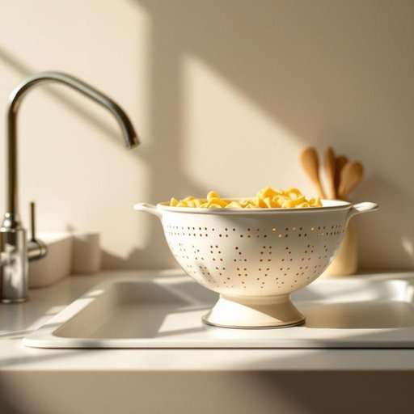

# colander

<h1 style="font-size: 2.5em; font-weight: 300; letter-spacing: 2px; margin: 0; color: #2c3e50;">
/ˈkɑləndər/
</h1>

---

---

## 例句

Could you please pass me the colander that's sitting next to the sink, the one with the slightly chipped handle which Mum bought last summer, as I need to drain the pasta before mixing it with the sauce simmering on the hob?

*Could(/kʊd/) you(/ju/) please(/pliz/) pass(/pæs/) me(/mi/) the(/ðə/) colander(/ˈkɑləndər/) that's(/ðæts/) sitting(/ˈsɪtɪŋ/) next(/nɛkst/) to(/tɪ/) the(/ðə/) sink,(/sɪŋk,/) the(/ðə/) one(/wən/) with(/wɪθ/) the(/ðə/) slightly(/sˈlaɪtli/) chipped(/ʧɪpt/) handle(/ˈhændəl/) which(/wɪʧ/) Mum(/məm/) bought(/bɔt/) last(/læst/) summer,(/ˈsəmər,/) as(/ɛz/) I(/aɪ/) need(/nid/) to(/tɪ/) drain(/dreɪn/) the(/ðə/) pasta(/ˈpɑstə/) before(/ˌbiˈfɔr/) mixing(/ˈmɪksɪŋ/) it(/ɪt/) with(/wɪθ/) the(/ðə/) sauce(/sɔs/) simmering(/ˈsɪmərɪŋ/) on(/ɔn/) the(/ðə/) hob?(/hɑb?/)*

**翻译：** 请把放在水槽旁边的那个滤锅递给我，就是那个手柄稍微有点缺口的，妈妈去年夏天买的。我需要先把意大利面沥干水分，再和正放在灶台上慢炖的酱汁拌在一起。

---

## 解释

英语单词“colander”作为名词，在家居生活用品语境中指一种常见的厨房用具，中文通常翻译为“滤盆”或“滤器”，主要用于盛放煮熟的面条、蔬菜或其他食材，通过底部和侧面的多个小孔快速滤去水分。具体使用场合多见于烹饪和餐饮准备过程中，如煮面后将面条从锅中倒入colander中滤水，或冲洗蔬菜时方便排除水分。英语学习者需要注意的是，colander是可数名词，复数形式为“colanders”，通常与动词搭配时需保持数的一致；常见搭配如“a colander to drain pasta”或“rinse vegetables in a colander”，表达应方便、灵活，且常出现在厨房用具、烹饪步骤的语境中。词源方面，“colander”源自拉丁语“colare”，意为“过滤”，经过中古英语演变而来，反映其过滤水分的功能。中文语境中，“colander”准确理解为一种带孔的滤水器具，无褒贬色彩，纯粹描述其实用功能，且在日常家庭厨房中极为常见。此外，colander在文化层面并无特殊隐含义，但作为厨房必备工具，其使用频率较高，掌握该词有助于准确表达与厨房烹饪相关的操作。

---

<small style="color: #999; font-size: 0.9em;">2025-07-27 09:14:04</small>

