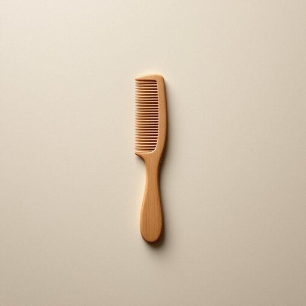

# comb

<h1 style="font-size: 2.5em; font-weight: 300; letter-spacing: 2px; margin: 0; color: #2c3e50;">
/koʊm/
</h1>

---

---

## 例句

Could you please hand me the wooden comb that’s kept next to the mirror in the bathroom cabinet, the one with the fine teeth that grandmother used to use to gently untangle her long hair every morning before breakfast?

*Could(/kʊd/) you(/ju/) please(/pliz/) hand(/hænd/) me(/mi/) the(/ðə/) wooden(/ˈwʊdən/) comb(/koʊm/) that’s(/that’s*/) kept(/kɛpt/) next(/nɛkst/) to(/tɪ/) the(/ðə/) mirror(/ˈmɪrər/) in(/ɪn/) the(/ðə/) bathroom(/ˈbæθˌrum/) cabinet,(/ˈkæbənət,/) the(/ðə/) one(/wən/) with(/wɪθ/) the(/ðə/) fine(/faɪn/) teeth(/tiθ/) that(/ðət/) grandmother(/ˈgrændˌməðər/) used(/juzd/) to(/tɪ/) use(/juz/) to(/tɪ/) gently(/ˈʤɛntli/) untangle(/ənˈtæŋgəl/) her(/hər/) long(/lɔŋ/) hair(/hɛr/) every(/ˈɛvəri/) morning(/ˈmɔrnɪŋ/) before(/ˌbiˈfɔr/) breakfast?(/ˈbrɛkfəst?/)*

**翻译：** 请你把浴室柜子里镜子旁边放着的那把木梳递给我，就是那把齿密的梳子，奶奶以前每天早晨早餐前用它轻柔地梳理她那长长的头发。

---

## 解释

“comb”作为家居生活用品中的名词，指的是一种用来梳理头发的工具，通常由塑料、木头或金属制成，有一排齿状结构，便于理顺头发或分缝。它常出现在日常护理、个人卫生等语境中，比如早晨起床后梳理头发、理发时使用或整理头发造型时。英语学习者在使用“comb”作为名词时需注意其复数形式为“combs”，且常与动词“use”、“have”、“lose”、“buy”连用，如“use a comb”或“lose your comb”；常见搭配有“hair comb”（头发梳）、“fine-tooth comb”（细齿梳，与“comb”构成固定表达，强调齿很细）、“plastic comb”（塑料梳）等，同时“comb”也可作为动词，意为“梳理”，但两用词性质不同，要根据语境区分。词源上，“comb”一词源自古英语“camb”，其根源可追溯到日耳曼语族，原指带齿的梳子，与现代含义基本一致，体现了其作为理发工具的悠久历史。在中文语境中，“comb”通常准确翻译为“梳子”，是极为日常且中性的词汇，无褒贬含义或特殊文化色彩，表述简洁明了，适用于个人生活和美发护理场合，因而使用时主要注意其分类（如梳子种类）和搭配，并无复杂用法或语气变化。

---

<small style="color: #999; font-size: 0.9em;">2025-07-27 09:14:04</small>

