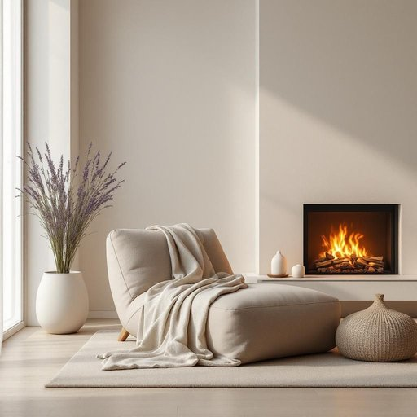

# comfort

<h1 style="font-size: 2.5em; font-weight: 300; letter-spacing: 2px; margin: 0; color: #2c3e50;">
/ˈkəmfərt/
</h1>

---

---

## 例句

After a long day at work, I always look forward to sinking into my favourite armchair, wrapped in the soft, knitted throw that provides not only warmth but also an unparalleled sense of comfort, which, combined with the gentle flicker of the fireplace and the subtle scent of lavender from the diffuser, transforms the living room into a perfect sanctuary for relaxation.

*After(/ˈæftər/) a(/ə/) long(/lɔŋ/) day(/deɪ/) at(/æt/) work,(/wərk,/) I(/aɪ/) always(/ˈɔlˌweɪz/) look(/lʊk/) forward(/ˈfɔrwərd/) to(/tɪ/) sinking(/ˈsɪŋkɪŋ/) into(/ˈɪntu/) my(/maɪ/) favourite(/ˈfeɪvərɪt/) armchair,(/ˈɑrmˌʧɛr,/) wrapped(/ræpt/) in(/ɪn/) the(/ðə/) soft,(/sɔft,/) knitted(/ˈnɪtɪd/) throw(/θroʊ/) that(/ðət/) provides(/prəˈvaɪdz/) not(/nɑt/) only(/ˈoʊnli/) warmth(/wɔrmθ/) but(/bət/) also(/ˈɔlsoʊ/) an(/ən/) unparalleled(/ənˈpɛrəˌlɛld/) sense(/sɛns/) of(/əv/) comfort,(/ˈkəmfərt,/) which,(/wɪʧ,/) combined(/kəmˈbaɪnd/) with(/wɪθ/) the(/ðə/) gentle(/ˈʤɛnəl/) flicker(/ˈflɪkər/) of(/əv/) the(/ðə/) fireplace(/ˈfaɪərˌpleɪs/) and(/ənd/) the(/ðə/) subtle(/ˈsətəl/) scent(/sɛnt/) of(/əv/) lavender(/ˈlævəndər/) from(/frəm/) the(/ðə/) diffuser,(/diffuser*,/) transforms(/trænsˈfɔrmz/) the(/ðə/) living(/ˈlɪvɪŋ/) room(/rum/) into(/ˈɪntu/) a(/ə/) perfect(/ˈpərˌfɪkt/) sanctuary(/ˈsæŋkʧuˌɛri/) for(/fər/) relaxation.(/ˌrilækˈseɪʃən./)*

**翻译：** 忙碌一天后，我总盼望着沉浸在我最喜欢的扶手椅中，披着柔软的针织毛毯，那不仅带来温暖，更带来无与伦比的舒适感。伴随着壁炉中温柔的火光闪烁和扩香器中淡淡的薰衣草香气，客厅瞬间变成了一个完美的放松圣地。

---

## 解释

在家居生活用品的语境中，英语单词“comfort”作为名词主要指“舒适感”或“安逸状态”，具体指为了提升居住环境品质而带来的身体或心理上的放松和满足，例如用于描述家具、床上用品、居家服装等如何提供温暖、柔软、支撑或便利，使人感到身心愉悦和放松，这一词常见于诸如“comfort of a sofa”（沙发的舒适感）、“comfort of home”（家的温馨舒适）等表达，强调物品为居住者带来的安适体验，学习者在使用“comfort”作为名词时应注意其通常作不可数名词出现，不能用复数形式，且常与冠词“the”连用，构成固定搭配“the comfort of...”，此外，也常与形容词搭配，如“great comfort”（极大的舒适），在语法上，“comfort”也可用作动词，但在本场景下侧重名词用法，词源上，“comfort”源自拉丁语“confortare”，意为“给予力量、增强力量”，经过法语传入英语，逐渐转变为“提供安慰、舒适”的含义，反映了从抽象的心理慰藉到具体的居住体验的演变，在中文语境中，“comfort”通常准确翻译为“舒适”、“安逸”或“舒适感”，强调居住环境中物理和心理双重满足的状态，属于褒义词，具有积极的生活质量和幸福感的文化内涵，常用以强调家居用品提高生活品质的功能与价值。

---

<small style="color: #999; font-size: 0.9em;">2025-07-27 09:14:04</small>

