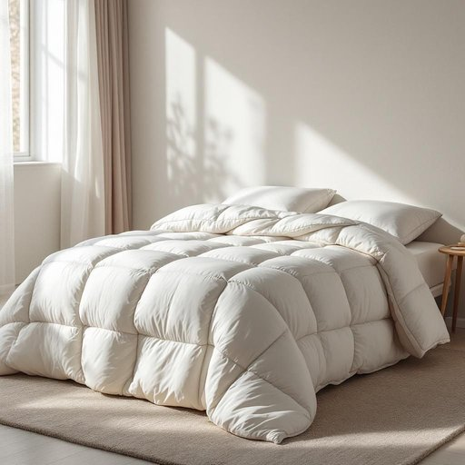

# comforter

<h1 style="font-size: 2.5em; font-weight: 300; letter-spacing: 2px; margin: 0; color: #2c3e50;">
/ˈkəmfərtər/
</h1>

---

---

## 例句

Although the weather has been unusually warm for this time of year, I still prefer to keep my comforter on the bed, especially during the evenings when the temperature tends to drop unexpectedly, because its thick, quilted layers not only provide warmth but also add a cozy, inviting aesthetic to the room that makes winding down after a long day much more pleasant.

*Although(/ˌɔlˈðoʊ/) the(/ðə/) weather(/ˈwɛðər/) has(/həz/) been(/bɪn/) unusually(/ənˈjuˌʒuəli/) warm(/wɔrm/) for(/fər/) this(/ðɪs/) time(/taɪm/) of(/əv/) year,(/jɪr,/) I(/aɪ/) still(/stɪl/) prefer(/prɪˈfər/) to(/tɪ/) keep(/kip/) my(/maɪ/) comforter(/ˈkəmfərtər/) on(/ɔn/) the(/ðə/) bed,(/bɛd,/) especially(/əˈspɛʃəli/) during(/ˈdʊrɪŋ/) the(/ðə/) evenings(/ˈivnɪŋz/) when(/wɪn/) the(/ðə/) temperature(/ˈtɛmpərəʧər/) tends(/tɛndz/) to(/tɪ/) drop(/drɔp/) unexpectedly,(/ˌənɪkˈspɛktɪdli,/) because(/bɪˈkəz/) its(/ɪts/) thick,(/θɪk,/) quilted(/kˈwɪltɪd/) layers(/leɪərz/) not(/nɑt/) only(/ˈoʊnli/) provide(/prəˈvaɪd/) warmth(/wɔrmθ/) but(/bət/) also(/ˈɔlsoʊ/) add(/æd/) a(/ə/) cozy,(/ˈkoʊzi,/) inviting(/ˌɪnˈvaɪtɪŋ/) aesthetic(/ɛsˈθɛtɪk/) to(/tɪ/) the(/ðə/) room(/rum/) that(/ðət/) makes(/meɪks/) winding(/ˈwaɪndɪŋ/) down(/daʊn/) after(/ˈæftər/) a(/ə/) long(/lɔŋ/) day(/deɪ/) much(/məʧ/) more(/mɔr/) pleasant.(/ˈplɛzənt./)*

**翻译：** 尽管这段时间的天气比往年同期异常温暖，我仍然喜欢在床上铺着厚被子，尤其是在夜晚气温常常出人意料地下降时。因为这厚实的绗缝被褥不仅能带来温暖，还增添了一种温馨宜人的美感，让一天疲惫之后的放松时光更加舒适惬意。

---

## 解释

英语单词“comforter”在家居生活用品场景中作为名词，通常指的是一种厚实的被子或洋被，常用于床铺上作为保暖盖物，尤其在冬季或较冷的天气中使用。具体使用场合多见于描述卧室布置、床上用品购买或家庭居住环境等语境中，如“a warm comforter on the bed”（床上的暖和被子）。在语法上，“comforter”作为可数名词，单复数形式分别为“comforter”和“comforters”，使用时通常与冠词、数词连用，如“a comforter”、“two comforters”；在表达上常与形容词搭配，如“thick comforter”、“down comforter”来描绘被子的材质或厚度；此外，与动词搭配时常见“put on a comforter”表示盖上被子。词源方面，“comforter”来自中世纪英语，源自拉丁语“comfortare”，意为“使强壮、使舒适”，最初含义泛指带来安慰的人或物，后在家居领域特指带来温暖和舒适的床上用品。中文语境中，“comforter”准确翻译为“被子”或“洋被”，通常指厚重且填充柔软的被褥，与床单、毯子等区分开来，强调其保暖功能。该词本身无褒贬含义，文化上体现了西方注重冬季保暖和舒适睡眠环境的生活习惯，因此学习者在使用时应根据具体语境区分“comforter”与类似词汇如“blanket”（毯子）或“duvet”（羽绒被）的细微差别。

---

<small style="color: #999; font-size: 0.9em;">2025-07-27 09:14:04</small>

