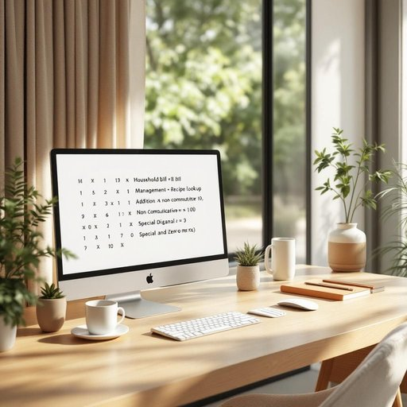

# computer

<h1 style="font-size: 2.5em; font-weight: 300; letter-spacing: 2px; margin: 0; color: #2c3e50;">
/kəmˈpjutər/
</h1>

---

---

## 例句

Although the computer, which I usually keep on the study desk next to the window to take advantage of natural light, occasionally slows down when multiple programmes are running simultaneously, it remains an indispensable tool for managing household bills, researching recipes, and streaming educational documentaries for the children in the living room.

*Although(/ˌɔlˈðoʊ/) the(/ðə/) computer,(/kəmˈpjutər,/) which(/wɪʧ/) I(/aɪ/) usually(/ˈjuʒəwəli/) keep(/kip/) on(/ɔn/) the(/ðə/) study(/ˈstədi/) desk(/dɛsk/) next(/nɛkst/) to(/tɪ/) the(/ðə/) window(/ˈwɪndoʊ/) to(/tɪ/) take(/teɪk/) advantage(/ædˈvæntɪʤ/) of(/əv/) natural(/ˈnæʧərəl/) light,(/laɪt,/) occasionally(/ɔˈkeɪʒənəˌli/) slows(/sloʊz/) down(/daʊn/) when(/wɪn/) multiple(/ˈməltəpəl/) programmes(/programmes*/) are(/ər/) running(/ˈrənɪŋ/) simultaneously,(/ˌsaɪməlˈteɪniəsli,/) it(/ɪt/) remains(/rɪˈmeɪnz/) an(/ən/) indispensable(/ˌɪndɪˈspɛnsəbəl/) tool(/tul/) for(/fər/) managing(/ˈmænəʤɪŋ/) household(/ˈhaʊsˌhoʊld/) bills,(/bɪlz,/) researching(/riˈsərʧɪŋ/) recipes,(/ˈrɛsəpiz,/) and(/ənd/) streaming(/ˈstrimɪŋ/) educational(/ˌɛʤəˈkeɪʃənəl/) documentaries(/ˌdɑkjəˈmɛnəriz/) for(/fər/) the(/ðə/) children(/ˈʧɪldrən/) in(/ɪn/) the(/ðə/) living(/ˈlɪvɪŋ/) room.(/rum./)*

**翻译：** 虽然我通常把电脑放在靠窗的书桌上以充分利用自然光，但当多个程序同时运行时，它偶尔会变慢，然而它依然是管理家庭账单、查找食谱以及在客厅为孩子们播放教育纪录片的不可或缺的工具。

---

## 解释

数学中的矩阵是按照一定的行和列排列的数字或符号的矩形阵列，用于表示和处理线性代数中的线性映射和变换，矩阵的大小由行数和列数决定，例如m行n列的矩阵记作m×n矩阵，矩阵的基本运算包括加法、减法、数乘和乘法，其中乘法不满足交换律，即AB不一定等于BA，常见的特殊矩阵有单位矩阵、对角矩阵和零矩阵，矩阵广泛应用于图像处理、计算机图形学、物理和工程问题的建模与求解，是线性代数的核心内容，在求解线性方程组、特征值和特征向量的计算中起着关键作用，矩阵的转置、逆矩阵和行列式等性质是理解其结构和功能的重要工具。

---

<small style="color: #999; font-size: 0.9em;">2025-07-27 09:14:04</small>

