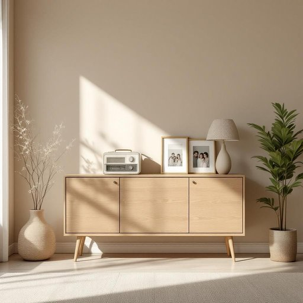

# console

<h1 style="font-size: 2.5em; font-weight: 300; letter-spacing: 2px; margin: 0; color: #2c3e50;">
/ˈkɑnsoʊl/
</h1>

---

---

## 例句

After rearranging the living room furniture to create a more open space, we decided to mount the vintage console, which not only houses our antique radio and a collection of family photos but also serves as a subtle focal point that complements the room’s minimalist décor.

*After(/ˈæftər/) rearranging(/ˌriərˈeɪnʤɪŋ/) the(/ðə/) living(/ˈlɪvɪŋ/) room(/rum/) furniture(/ˈfərnɪʧər/) to(/tɪ/) create(/kriˈeɪt/) a(/ə/) more(/mɔr/) open(/ˈoʊpən/) space,(/speɪs,/) we(/wi/) decided(/ˌdɪˈsaɪdɪd/) to(/tɪ/) mount(/maʊnt/) the(/ðə/) vintage(/ˈvɪntɪʤ/) console,(/ˈkɑnsoʊl,/) which(/wɪʧ/) not(/nɑt/) only(/ˈoʊnli/) houses(/ˈhaʊsɪz/) our(/ɑr/) antique(/ænˈtik/) radio(/ˈreɪdiˌoʊ/) and(/ənd/) a(/ə/) collection(/kəˈlɛkʃən/) of(/əv/) family(/ˈfæməli/) photos(/ˈfoʊˌtoʊz/) but(/bət/) also(/ˈɔlsoʊ/) serves(/sərvz/) as(/ɛz/) a(/ə/) subtle(/ˈsətəl/) focal(/ˈfoʊkəl/) point(/pɔɪnt/) that(/ðət/) complements(/ˈkɑmpləmənts/) the(/ðə/) room’s(/room’s*/) minimalist(/ˈmɪnəməlɪst/) décor.(/décor*./)*

**翻译：** 在重新布置客厅家具以营造更开阔的空间之后，我们决定安装这台复古音响柜。它不仅陈列着我们的古董收音机和一组家庭照片，还作为一个低调的视觉焦点，与房间的极简装饰相得益彰。

---

## 解释

在家居生活用品的语境中，英语单词“console”作为名词通常指的是一种用于放置或支持电子设备（如电视、音响系统或游戏设备）的家具，如电视柜或控制台。具体使用场合多出现在描述家里的娱乐区、客厅或书房中，用于说明某件家具的功能和形态。英语学习者在使用“console”时需要注意其名词形式不可直接与动词“console”（安慰）混淆，且通常与具体家具类型搭配，如“console table”（控制台桌）、“TV console”或“audio console”。此外，“console”在搭配中多与家具或电子设备的描述词连用，表达完整意义。词源上，“console”源自拉丁语“consolidare”，意指“巩固”或“支持”，后来演变为指带有功能支撑作用的家具或设备控制面板。中文中，“console”在家居生活用品情境下最准确的翻译为“控制台”、“电视柜”或“操作台”，根据具体家具形态和用途有所不同，不应简单理解为普通家具或装饰品。该词本身无褒贬色彩，属于中性表达，文化内涵主要关联现代家庭娱乐和电子设备布置的实用家具，理解时应结合具体语境，以免误解为心理慰藉相关的“安慰”含义。

---

<small style="color: #999; font-size: 0.9em;">2025-07-27 09:14:04</small>

