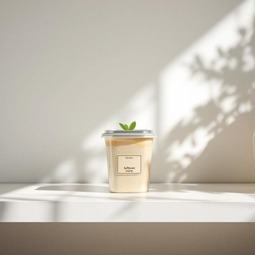

# container

<h1 style="font-size: 2.5em; font-weight: 300; letter-spacing: 2px; margin: 0; color: #2c3e50;">
/kənˈteɪnər/
</h1>

---

---

## 例句

The plastic container on the kitchen shelf, which had a faded label and stored last month’s leftover curry, needed to be cleared out and thoroughly washed before deciding if it could be reused for storing the fresh vegetables bought yesterday.

*The(/ðə/) plastic(/ˈplæstɪk/) container(/kənˈteɪnər/) on(/ɔn/) the(/ðə/) kitchen(/ˈkɪʧən/) shelf,(/ʃɛlf,/) which(/wɪʧ/) had(/hæd/) a(/ə/) faded(/ˈfeɪdɪd/) label(/ˈleɪbəl/) and(/ənd/) stored(/stɔrd/) last(/læst/) month’s(/month’s*/) leftover(/ˈlɛfˌtoʊvər/) curry,(/ˈkəri,/) needed(/ˈnidɪd/) to(/tɪ/) be(/bi/) cleared(/klɪrd/) out(/aʊt/) and(/ənd/) thoroughly(/ˈθəroʊli/) washed(/wɑʃt/) before(/ˌbiˈfɔr/) deciding(/ˌdɪˈsaɪdɪŋ/) if(/ɪf/) it(/ɪt/) could(/kʊd/) be(/bi/) reused(/riuzd/) for(/fər/) storing(/ˈstɔrɪŋ/) the(/ðə/) fresh(/frɛʃ/) vegetables(/ˈvɛʤtəbəlz/) bought(/bɔt/) yesterday.(/ˈjɛstərˌdeɪ./)*

**翻译：** 厨房架子上的那个塑料容器，贴着已经褪色的标签，装着上个月剩下的咖喱，需要先清理干净并彻底清洗，然后才能决定是否可以用来存放昨天买的新鲜蔬菜。

---

## 解释

英语单词“container”作为名词，在家居生活用品场景中通常指用于存放、盛装各种物品的器皿或容器，如盒子、罐子、瓶子、箱子等，具体使用场合包括厨房储藏食材、浴室收纳洗漱用品、储藏房内收纳杂物等，语境较为广泛且实用。英语学习者在使用“container”时需注意其复数形式为“containers”，且常见搭配有“storage container”（储物容器）、“plastic container”（塑料容器）、“food container”（食物容器）等，动词用法较少，通常作为名词使用；表达时可与介词短语搭配，如“container for storing”（用于存储的容器）。词源方面，“container”源自拉丁语“containere”，意为“包含、容纳”，经过法语“container”进入英语，强调其“容纳”的功能。中文语境下，“container”准确翻译为“容器”或“储物容器”，需根据具体物品类型灵活选择，如“盒子”、“罐子”等更具体称谓，且无明显褒贬含义，主要属于中性词，强调其实用性和功能性，在家庭生活中通常带有整洁、有序、便于储存和管理的正面文化内涵，因此理解时应注重其工具属性及实际功能而非抽象概念。

---

<small style="color: #999; font-size: 0.9em;">2025-07-27 09:14:04</small>

