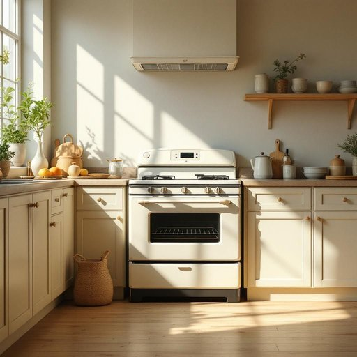

# cooker

<h1 style="font-size: 2.5em; font-weight: 300; letter-spacing: 2px; margin: 0; color: #2c3e50;">
/ˈkʊkər/
</h1>

---

---

## 例句

I was about to start dinner when I realised that the old cooker, which had been a reliable kitchen companion for over a decade, suddenly stopped working, leaving me no choice but to call an engineer to fix the electric hob and oven before I could continue with the recipe.

*I(/aɪ/) was(/wɑz/) about(/əˈbaʊt/) to(/tɪ/) start(/stɑrt/) dinner(/ˈdɪnər/) when(/wɪn/) I(/aɪ/) realised(/ˈriəˌlaɪzd/) that(/ðət/) the(/ðə/) old(/oʊld/) cooker,(/ˈkʊkər,/) which(/wɪʧ/) had(/hæd/) been(/bɪn/) a(/ə/) reliable(/rɪˈlaɪəbəl/) kitchen(/ˈkɪʧən/) companion(/kəmˈpænjən/) for(/fər/) over(/ˈoʊvər/) a(/ə/) decade,(/ˈdɛkeɪd,/) suddenly(/ˈsədənli/) stopped(/stɑpt/) working,(/ˈwərkɪŋ,/) leaving(/ˈlivɪŋ/) me(/mi/) no(/noʊ/) choice(/ʧɔɪs/) but(/bət/) to(/tɪ/) call(/kɔl/) an(/ən/) engineer(/ˈɛnʤəˈnɪr/) to(/tɪ/) fix(/fɪks/) the(/ðə/) electric(/ɪˈlɛktrɪk/) hob(/hɑb/) and(/ənd/) oven(/ˈəvən/) before(/ˌbiˈfɔr/) I(/aɪ/) could(/kʊd/) continue(/kənˈtɪnju/) with(/wɪθ/) the(/ðə/) recipe.(/ˈrɛsəpi./)*

**翻译：** 正当我准备开始做晚饭时，才发现那台陪伴厨房十余年、一直可靠的老灶突然坏了，不得不请工程师来修理电炉和烤箱，才能继续进行食谱。

---

## 解释

英语单词“cooker”作为名词在家居生活用品的语境中通常指用来烹饪食物的设备，最常见的是“炉灶”或“炊具”，包括燃气炉、电炉甚至带有烤箱的组合装置。具体使用场合多出现在厨房环境，如谈论做饭用的设备时，例如“The cooker is broken”表示“炉子坏了”。英语学习者使用该词时需注意它是一个可数名词，通常前面会有冠词或指示代词，如“a cooker”、“the cooker”，且“cooker”与“stove”或“oven”有细微区别：在英国英语中，“cooker”多指带烤箱的整套烹饪设备，而“stove”更偏向于燃烧燃料的炉具。常见搭配有“gas cooker”（燃气炉）、“electric cooker”（电炉）、“pressure cooker”（高压锅，虽含“cooker”，但指特定烹饪工具，且结构不同）。词源方面，“cooker”源自动词“cook”，加上表示物品的后缀“-er”，即“做饭的人或物”，最初用于指任何进行烹饪的工具或装置，后来演变专指烹饪设备。在中文语境中，它准确的译法为“炉灶”或“炊具”，依具体设备类型可译为“燃气炉”、“电饭煲”等，但普遍理解为厨房用的整体烹饪设备，无特殊褒贬色彩或文化内涵，仅为中性词汇。总之，理解“cooker”需结合具体语境，区分不同烹饪设备，避免混淆同类词汇的细微差别。

---

<small style="color: #999; font-size: 0.9em;">2025-07-27 09:14:04</small>

