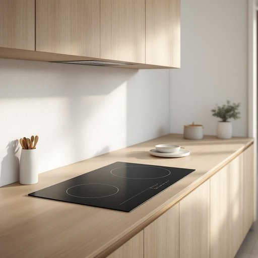

# cooktop

<h1 style="font-size: 2.5em; font-weight: 300; letter-spacing: 2px; margin: 0; color: #2c3e50;">
/cooktop*/
</h1>

---

---

## 例句

After we renovated the kitchen last month, we decided to install an induction cooktop, which not only heats up much faster than the traditional gas hob we had before but also features a sleek glass surface that's incredibly easy to clean, making our daily cooking routine far more efficient and enjoyable.

*After(/ˈæftər/) we(/wi/) renovated(/ˈrɛnəˌveɪtɪd/) the(/ðə/) kitchen(/ˈkɪʧən/) last(/læst/) month,(/mənθ,/) we(/wi/) decided(/ˌdɪˈsaɪdɪd/) to(/tɪ/) install(/ˌɪnˈstɔl/) an(/ən/) induction(/ˌɪnˈdəkʃən/) cooktop,(/cooktop*,/) which(/wɪʧ/) not(/nɑt/) only(/ˈoʊnli/) heats(/hits/) up(/əp/) much(/məʧ/) faster(/ˈfæstər/) than(/ðən/) the(/ðə/) traditional(/trəˈdɪʃənəl/) gas(/gæs/) hob(/hɑb/) we(/wi/) had(/hæd/) before(/ˌbiˈfɔr/) but(/bət/) also(/ˈɔlsoʊ/) features(/ˈfiʧərz/) a(/ə/) sleek(/slik/) glass(/glæs/) surface(/ˈsərfəs/) that's(/ðæts/) incredibly(/ˌɪnˈkrɛdəbli/) easy(/ˈizi/) to(/tɪ/) clean,(/klin,/) making(/ˈmeɪkɪŋ/) our(/ɑr/) daily(/ˈdeɪli/) cooking(/ˈkʊkɪŋ/) routine(/ruˈtin/) far(/fɑr/) more(/mɔr/) efficient(/ɪˈfɪʃənt/) and(/ənd/) enjoyable.(/ˌɛnˈʤɔɪəbəl./)*

**翻译：** 上个月我们翻新厨房后，决定安装一台电磁炉。它不仅加热速度远快于我们以前使用的传统燃气灶，还配备了光滑的玻璃面板，清洁极为方便，使我们的日常烹饪更加高效且愉快。

---

## 解释

“cooktop”作为名词，指的是厨房中嵌入工作台面上的炉灶面板，通常包括燃气或电加热炉眼，专门用于烹饪食物的表面装置，而不包括烤箱或其他厨房用具。它常出现在描述现代厨房设施、家居装修或厨具购买的场合，如“安装新的cooktop”或“厨房配备了电磁炉cooktop”。英语学习者使用该词时需注意，“cooktop”是可数名词，单复数形式分别为“cooktop”和“cooktops”，且多和动词“install”、“use”、“clean”搭配，如“install a cooktop”或“clean the cooktop”；此外，它也常与限定词连用，例如“gas cooktop”（燃气炉灶）或“electric cooktop”（电磁炉灶），以明确具体类型。词源上，“cooktop”由“cook”（烹饪）和“top”（顶部、表面）组合而成，直接指明了其用途和位置，起源于厨房用具的命名习惯，强调烹饪时所使用的台面部分。中文语境中，“cooktop”准确翻译为“灶台”或“炉灶面板”，区别于“炉子”或“灶具”的更广义表达，重点在于其作为嵌入式烹饪表面的功能，没有褒义或贬义色彩，属于中性且实用的家居生活用品词汇。

---

<small style="color: #999; font-size: 0.9em;">2025-07-27 09:14:04</small>

