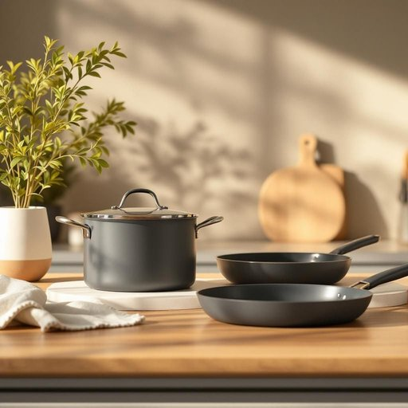

# cookware

<h1 style="font-size: 2.5em; font-weight: 300; letter-spacing: 2px; margin: 0; color: #2c3e50;">
/ˈkʊkˌwɛr/
</h1>

---

---

## 例句

When we finally decided to renovate the kitchen, Emma insisted on replacing all the old cookware with professional-grade pots and pans that not only promised better heat distribution but also matched the minimalist aesthetic we wanted to achieve.

*When(/wɪn/) we(/wi/) finally(/ˈfaɪnəli/) decided(/ˌdɪˈsaɪdɪd/) to(/tɪ/) renovate(/ˈrɛnəˌveɪt/) the(/ðə/) kitchen,(/ˈkɪʧən,/) Emma(/ˈɛmə/) insisted(/ˌɪnˈsɪstɪd/) on(/ɔn/) replacing(/rɪˈpleɪsɪŋ/) all(/ɔl/) the(/ðə/) old(/oʊld/) cookware(/ˈkʊkˌwɛr/) with(/wɪθ/) professional-grade(/professional-grade*/) pots(/pɑts/) and(/ənd/) pans(/pænz/) that(/ðət/) not(/nɑt/) only(/ˈoʊnli/) promised(/ˈprɑməst/) better(/ˈbɛtər/) heat(/hit/) distribution(/ˌdɪstrəˈbjuʃən/) but(/bət/) also(/ˈɔlsoʊ/) matched(/mæʧt/) the(/ðə/) minimalist(/ˈmɪnəməlɪst/) aesthetic(/ɛsˈθɛtɪk/) we(/wi/) wanted(/ˈwɔntɪd/) to(/tɪ/) achieve.(/əˈʧiv./)*

**翻译：** 当我们最终决定翻新厨房时，艾玛坚持要把所有旧的炊具换成专业级的锅具，不仅承诺能更均匀地传热，还能符合我们想要达到的极简美学。

---

## 解释

“cookware”作为名词，指的是厨房中用于烹调用的各种器具和用具，包括锅、平底锅、炒锅、炖锅等，主要出现在家居生活用品相关的场合，如厨房布置、烹饪教学、厨房设备购物等语境中。英语学习者在使用该词时应注意，“cookware”通常是不可数名词，不常用复数形式，表达时多用单数形式表示总体厨具类别；常见搭配包括“kitchen cookware”（厨房炊具）、“non-stick cookware”（不粘锅具）、“cast iron cookware”（铸铁炊具）等，表达上可与形容词连用，以具体说明材质或特点。词源方面，“cookware”由“cook”（烹调、厨师）与“ware”（器皿，器具）合成，意指供烹饪使用的器皿，这种合成方式在英语中较为常见，反映了其功能性的命名特点。在中文语境中，准确译为“炊具”或“厨具”，侧重于烹饪所用的锅具和器皿，与“餐具”（用于就餐的器皿）区分明显。该词基本上无贬义或褒义色彩，属于中性词汇，在现代家庭和厨师专业领域中广泛应用，体现了生活品质和烹饪技术发展的一个重要方面。

---

<small style="color: #999; font-size: 0.9em;">2025-07-27 09:14:04</small>

