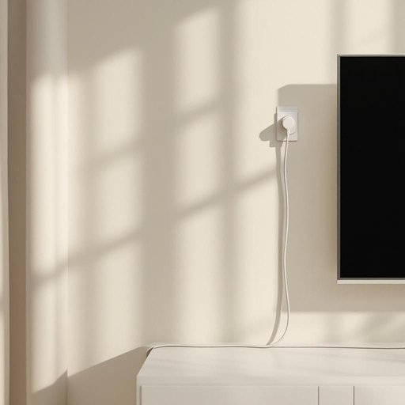

# cord

<h1 style="font-size: 2.5em; font-weight: 300; letter-spacing: 2px; margin: 0; color: #2c3e50;">
/kɔrd/
</h1>

---

---

## 例句

Could you please check if the cord behind the television is securely plugged into the power socket, and while you're at it, make sure it’s not tangled with the charger cords on the desk, as that tends to cause quite a mess and might even create a tripping hazard?

*Could(/kʊd/) you(/ju/) please(/pliz/) check(/ʧɛk/) if(/ɪf/) the(/ðə/) cord(/kɔrd/) behind(/bɪˈhaɪnd/) the(/ðə/) television(/ˈtɛləˌvɪʒən/) is(/ɪz/) securely(/sɪˈkjʊrli/) plugged(/pləgd/) into(/ˈɪntu/) the(/ðə/) power(/paʊər/) socket,(/ˈsɑkət,/) and(/ənd/) while(/waɪl/) you're(/jʊr/) at(/æt/) it,(/ɪt,/) make(/meɪk/) sure(/ʃʊr/) it’s(/it’s*/) not(/nɑt/) tangled(/ˈtæŋgəld/) with(/wɪθ/) the(/ðə/) charger(/ˈʧɑrʤər/) cords(/kɔrdz/) on(/ɔn/) the(/ðə/) desk,(/dɛsk,/) as(/ɛz/) that(/ðət/) tends(/tɛndz/) to(/tɪ/) cause(/kɔz/) quite(/kwaɪt/) a(/ə/) mess(/mɛs/) and(/ənd/) might(/maɪt/) even(/ˈivɪn/) create(/kriˈeɪt/) a(/ə/) tripping(/ˈtrɪpɪŋ/) hazard?(/ˈhæzərd?/)*

**翻译：** 请您确认电视后面的电源线是否已经牢固插入插座，同时顺便检查一下它是否与桌上的充电线缠绕在一起，因为那样容易造成杂乱，甚至可能带来绊倒的危险。

---

## 解释

英语单词“cord”作为名词，在家居生活用品场景中通常指细绳、绳索、电线或电源线等，具体使用场合包括连接电器设备的电源线（如lamp cord，灯线）、用于捆绑或悬挂物品的细绳，以及缝纫或装饰用的粗细不一的绳索。学习者在使用“cord”时需要注意它是可数名词，常见搭配有“electric cord”（电线）、“extension cord”（延长线）、“pull cord”（拉绳；如灯具开关用的拉绳）、“cord length”（绳长）等，此外，“cord”在表示电线时通常指内含导线的外包绝缘线，与“string”（细细的绳状物）和“rope”（较粗的绳索）有所区别。语法上，“cord”通常用单数或复数形式，复数为“cords”，表示多条绳子或多根线。词源方面，“cord”源自拉丁语“chorda”，意为“弦”或“细绳”，通过古法语传入英语，保持了“细长绳索”的基本含义。中文中，“cord”常被准确翻译为“绳索”、“绳子”或“电线”，具体依上下文确定，特别是在家居环境中多指电器的电源线或连接线。该词本身无明显褒贬色彩或特殊文化内涵，但不同语境下可能引申为“控制”或“连接”的隐喻，如“feel the cord”，意指感知联系等。在教学或交流中，正确区分“cord”与其他类似绳索词汇，理解其与电线相关的专业搭配，对于提高词汇应用准确性尤为重要。

---

<small style="color: #999; font-size: 0.9em;">2025-07-27 09:14:04</small>

