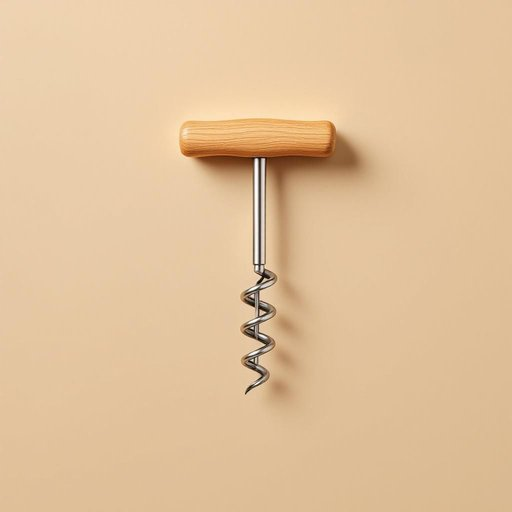

# corkscrew

<h1 style="font-size: 2.5em; font-weight: 300; letter-spacing: 2px; margin: 0; color: #2c3e50;">
/ˈkɔrkˌskru/
</h1>

---

---

## 例句

Could you please pass me the corkscrew that’s usually kept in the top drawer of the kitchen cabinet, the one with the wooden handle and the small foil cutter attached, because I’m struggling to open this bottle of vintage red wine for our dinner guests?

*Could(/kʊd/) you(/ju/) please(/pliz/) pass(/pæs/) me(/mi/) the(/ðə/) corkscrew(/ˈkɔrkˌskru/) that’s(/that’s*/) usually(/ˈjuʒəwəli/) kept(/kɛpt/) in(/ɪn/) the(/ðə/) top(/tɔp/) drawer(/drɔr/) of(/əv/) the(/ðə/) kitchen(/ˈkɪʧən/) cabinet,(/ˈkæbənət,/) the(/ðə/) one(/wən/) with(/wɪθ/) the(/ðə/) wooden(/ˈwʊdən/) handle(/ˈhændəl/) and(/ənd/) the(/ðə/) small(/smɔl/) foil(/fɔɪl/) cutter(/ˈkətər/) attached,(/əˈtæʧt,/) because(/bɪˈkəz/) I’m(/i’m*/) struggling(/ˈstrəgəlɪŋ/) to(/tɪ/) open(/ˈoʊpən/) this(/ðɪs/) bottle(/ˈbɑtəl/) of(/əv/) vintage(/ˈvɪntɪʤ/) red(/rɛd/) wine(/waɪn/) for(/fər/) our(/ɑr/) dinner(/ˈdɪnər/) guests?(/gɛsts?/)*

**翻译：** 您能把厨房橱柜顶层抽屉里那个带有木柄、并附有小锡纸刀的开瓶器递给我吗？我正费力地想打开这瓶为晚宴客人准备的陈年红酒。

---

## 解释

英语单词“corkscrew”作为名词在家居生活用品语境中主要指用于开瓶塞的螺旋开瓶器，常用于酒瓶尤其是红酒瓶的开盖场合。当人们需要取出瓶塞时，通常会用到这种带有金属螺旋杆和手柄的工具，它通过旋入软木塞后拔出实现开瓶功能。英语学习者在使用“corkscrew”时需注意其作为可数名词的语法特点，通常与冠词连用，例如a corkscrew表示“一把开瓶器”，在表达中常见搭配有“use a corkscrew”（使用开瓶器）、“bring a corkscrew to the party”（带开瓶器去聚会）等，此外“corkscrew”也可作动词，表示“螺旋形地移动”或“旋转前进”，但在家居生活用品语境下主要指名词用法。词源方面，“corkscrew”由“cork”（软木塞）和“screw”（螺丝）合成，形象地描述了其工作原理，即通过螺旋杆拧入软木塞再拔出的构造，起源于18世纪末期的开瓶工具发明。中文语境中应译为“开瓶器”或“螺旋开瓶器”，准确反映工具的功能和结构，避免误解为其他含义。该词在家居领域无褒贬色彩或特殊文化内涵，是一种普遍使用且功能明确的实用工具名称。

---

<small style="color: #999; font-size: 0.9em;">2025-07-27 09:14:04</small>

