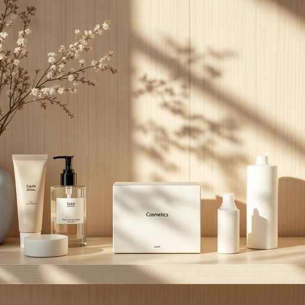

# cosmetic

<h1 style="font-size: 2.5em; font-weight: 300; letter-spacing: 2px; margin: 0; color: #2c3e50;">
/kɑzˈmɛtɪk/
</h1>

---

---

## 例句

Could you please check if the box labeled 'cosmetic' on the bathroom shelf contains the new moisturizer and lip balm that Sarah ordered last week, since we've run out of most of our everyday toiletries and it's quite inconvenient to make a last-minute trip to the store?

*Could(/kʊd/) you(/ju/) please(/pliz/) check(/ʧɛk/) if(/ɪf/) the(/ðə/) box(/bɑks/) labeled(/ˈleɪbəld/) 'cosmetic'(/'kɑzˈmɛtɪk'/) on(/ɔn/) the(/ðə/) bathroom(/ˈbæθˌrum/) shelf(/ʃɛlf/) contains(/kənˈteɪnz/) the(/ðə/) new(/nu/) moisturizer(/ˈmɔɪsʧərˌaɪzər/) and(/ənd/) lip(/lɪp/) balm(/bɑm/) that(/ðət/) Sarah(/ˈsɛrə/) ordered(/ˈɔrdərd/) last(/læst/) week,(/wik,/) since(/sɪns/) we've(/wiv/) run(/rən/) out(/aʊt/) of(/əv/) most(/moʊst/) of(/əv/) our(/ɑr/) everyday(/ˈɛvriˈdeɪ/) toiletries(/ˈtɔɪlətriz/) and(/ənd/) it's(/ɪts/) quite(/kwaɪt/) inconvenient(/ˌɪnkənˈvinjənt/) to(/tɪ/) make(/meɪk/) a(/ə/) last-minute(/ˌlæsˈmɪnət/) trip(/trɪp/) to(/tɪ/) the(/ðə/) store?(/stɔr?/)*

**翻译：** 请您帮忙查看一下浴室架子上标有“化妆品”的盒子里，是否放着萨拉上周订购的新款保湿霜和润唇膏？因为我们的日常洗漱用品大多已经用完，临时去一趟商店实在不太方便。

---

## 解释

英语单词cosmetic作为名词，在家居生活用品的语境下通常指化妆品，即用于美容、美化皮肤或改善外观的产品，如面霜、口红、粉底等。具体使用场合多见于购物、日常生活用品介绍、美容护肤讨论等语境中，比如“I went to buy some cosmetics”意为“我去买了一些化妆品”。英语学习者需要注意的是，作为名词时，cosmetic一般指复数形式cosmetics，单数形式很少单独使用且不常见，此外，cosmetic多与动词buy、use、apply、remove搭配，常用表达有cosmetic product(s)、cosmetic industry等。词源方面，cosmetic来源于希腊语kosmētikos，意为擅长装饰的，与装饰、整理相关联，其含义逐渐演变为美容用品。在中文语境中，cosmetic最准确的翻译是化妆品，强调其用于外部美容的功能，而非药品或治疗用具。需要注意的是，cosmetic在英文中偶尔也可作形容词使用，表示表面的、装饰性的，如cosmetic changes（表面上的改变），但作为名词时并无这一含义。文化层面上，cosmetic产品往往关联个人形象和社会审美，具有积极的美化含义，但在某些语境下也可能引申出浮于表面或仅仅是装饰的贬义，需结合上下文准确理解。

---

<small style="color: #999; font-size: 0.9em;">2025-07-27 09:14:04</small>

