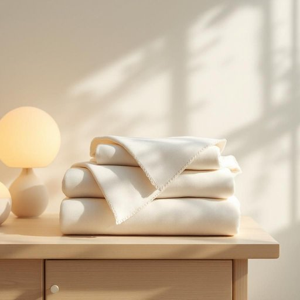

# cotton

<h1 style="font-size: 2.5em; font-weight: 300; letter-spacing: 2px; margin: 0; color: #2c3e50;">
/ˈkɔtən/
</h1>

---

---

## 例句

Could you please check if there’s any cotton left in the linen cupboard, especially the kind that’s soft enough for making those handkerchiefs we usually keep beside the bedside lamps, because I want to sew a few new covers before the guests arrive this weekend?

*Could(/kʊd/) you(/ju/) please(/pliz/) check(/ʧɛk/) if(/ɪf/) there’s(/there’s*/) any(/ˈɛni/) cotton(/ˈkɔtən/) left(/lɛft/) in(/ɪn/) the(/ðə/) linen(/ˈlɪnən/) cupboard,(/ˈkəbərd,/) especially(/əˈspɛʃəli/) the(/ðə/) kind(/kaɪnd/) that’s(/that’s*/) soft(/sɔft/) enough(/ɪˈnəf/) for(/fər/) making(/ˈmeɪkɪŋ/) those(/ðoʊz/) handkerchiefs(/ˈhæŋkərʧəfs/) we(/wi/) usually(/ˈjuʒəwəli/) keep(/kip/) beside(/ˌbiˈsaɪd/) the(/ðə/) bedside(/ˈbɛdˌsaɪd/) lamps,(/læmps,/) because(/bɪˈkəz/) I(/aɪ/) want(/wɔnt/) to(/tɪ/) sew(/soʊ/) a(/ə/) few(/fju/) new(/nu/) covers(/ˈkəvərz/) before(/ˌbiˈfɔr/) the(/ðə/) guests(/gɛsts/) arrive(/əraɪv/) this(/ðɪs/) weekend?(/ˈwiˌkɪnd?/)*

**翻译：** 请帮我检查一下亚麻柜里是否还有棉布，尤其是那种柔软到可以用来制作我们平时放在床头灯旁手帕的棉布，因为我想在本周末客人来之前缝制几套新的套子。

---

## 解释

英语单词"cotton"作为名词在家居生活用品场景中，主要指的是“棉花”或“棉织物”，即由棉纤维制成的纺织品，常见于床上用品如棉制床单、棉被罩、窗帘、衣物及其他家居纺织品中，使用场合多见于描述家纺产品材质时，比如“cotton sheets”（棉质床单）、“cotton towels”（棉质毛巾），强调材料的天然、透气和舒适特性，英语学习者在使用"cotton"时应注意其作为不可数名词时通常指物质材质，复数形式较少，且搭配常见形容词有“pure cotton”（纯棉）、“organic cotton”（有机棉）等，语法上，"cotton"可以用作物质名词，不可数，但在某些语境下可指具体的“棉纱”或“棉织物”，需要根据上下文判断，其词源源自古法语“cotoun”或西班牙语“algodón”，最终追溯到阿拉伯语“al-qutn”，反映了棉花作为重要经济作物和纺织原料的历史传播，中文语境中，"cotton"准确译为“棉”或“棉花”，具体指“棉织物”时可译为“棉布”或“棉制品”，常用于强调天然、舒适和环保的家居纺织材料，该词本身无明显褒贬色彩，但在文化上因其天然环保属性，常与健康、舒适的生活方式相联系。

---

<small style="color: #999; font-size: 0.9em;">2025-07-27 09:14:04</small>

