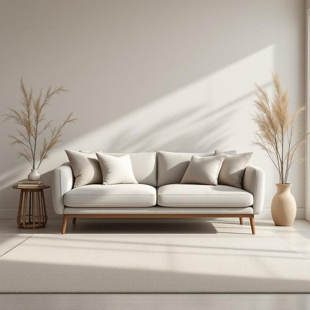

# couch

<h1 style="font-size: 2.5em; font-weight: 300; letter-spacing: 2px; margin: 0; color: #2c3e50;">
/kaʊʧ/
</h1>

---

---

## 例句

After dedicating countless hours meticulously organizing the countless shelves filled with fragile antique books, I finally settled into the cozy armchair by the grand window, which, despite the fading afternoon light and gentle creaking of the house, provided an unparalleled ambiance for immersing myself in stories from a bygone era.

*After(/ˈæftər/) dedicating(/ˈdɛdɪˌkeɪtɪŋ/) countless(/ˈkaʊntləs/) hours(/aʊərz/) meticulously(/məˈtɪkjələsli/) organizing(/ˈɔrgəˌnaɪzɪŋ/) the(/ðə/) countless(/ˈkaʊntləs/) shelves(/ʃɛlvz/) filled(/fɪld/) with(/wɪθ/) fragile(/ˈfræʤəl/) antique(/ænˈtik/) books,(/bʊks,/) I(/aɪ/) finally(/ˈfaɪnəli/) settled(/ˈsɛtəld/) into(/ˈɪntu/) the(/ðə/) cozy(/ˈkoʊzi/) armchair(/ˈɑrmˌʧɛr/) by(/baɪ/) the(/ðə/) grand(/grænd/) window,(/ˈwɪndoʊ,/) which,(/wɪʧ,/) despite(/dɪˈspaɪt/) the(/ðə/) fading(/ˈfeɪdɪŋ/) afternoon(/ˌæftərˈnun/) light(/laɪt/) and(/ənd/) gentle(/ˈʤɛnəl/) creaking(/ˈkrikɪŋ/) of(/əv/) the(/ðə/) house,(/haʊs,/) provided(/prəˈvaɪdɪd/) an(/ən/) unparalleled(/ənˈpɛrəˌlɛld/) ambiance(/ˈæmbiəns/) for(/fər/) immersing(/immersing*/) myself(/ˌmaɪˈsɛlf/) in(/ɪn/) stories(/ˈstɔriz/) from(/frəm/) a(/ə/) bygone(/ˈbaɪˌgɔn/) era.(/ˈɪrə./)*

**翻译：** 在花费无数时光细心整理那满载脆弱古籍的无数书架后，我终于安坐在那靠近大窗的舒适扶手椅上。尽管夕阳余晖渐淡，屋内细微的吱呀声隐约可闻，这一角落仍营造出无与伦比的氛围，让我沉浸于逝去年代的故事之中。

---

## 解释

英语单词“couch”作为名词在家居生活用品语境中指的是一种带软垫、通常有靠背和扶手的长椅，供多人坐卧，类似于中文中的“沙发”或“长沙发”，常见于客厅或休息区，用于休息、交谈或观看电视。具体使用场合多为描述室内家具，例如“living room couch”（客厅沙发）、“comfortable couch”（舒适的沙发）等。英语学习者在使用“couch”时需注意其单数和复数形式（复数为“couches”），此外，“couch”作为名词常与形容词搭配，如“leather couch”（皮沙发）、“sectional couch”（组合沙发）等，也常用于固定短语如“sit on the couch”（坐在沙发上）。它有时跟“sofa”或“settee”可互换，但“couch”较口语，且在美式英语中使用更广泛。词源上，“couch”源自中古法语“couchier”，意为“躺下”，进而引申指可供人躺卧的家具，这反映了其最初设计供躺卧休息的功能。在中文语境下，准确翻译为“沙发”或“长沙发”，强调其家居家具的属性，且无褒贬含义，“couch”作为家具名词本身没有特殊的文化内涵或色彩，属于中性词汇，但需避免与动词“to couch”（表达、措辞）混淆。整体来看，掌握“couch”的基本语法、搭配及文化背景有助于更自然地使用和理解这一常用家居词汇。

---

<small style="color: #999; font-size: 0.9em;">2025-07-27 09:14:04</small>

