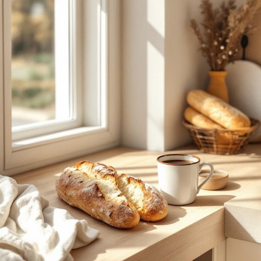

# counter

<h1 style="font-size: 2.5em; font-weight: 300; letter-spacing: 2px; margin: 0; color: #2c3e50;">
/ˈkaʊntər/
</h1>

---

---

## 例句

While I was wiping down the kitchen counter cluttered with yesterday’s mail and a half-empty coffee cup, I noticed that the new baguette I bought this morning had already gone stale, so I decided to quickly prepare some fresh toast before the guests arrived.

*While(/waɪl/) I(/aɪ/) was(/wɑz/) wiping(/ˈwaɪpɪŋ/) down(/daʊn/) the(/ðə/) kitchen(/ˈkɪʧən/) counter(/ˈkaʊntər/) cluttered(/ˈklətərd/) with(/wɪθ/) yesterday’s(/yesterday’s*/) mail(/meɪl/) and(/ənd/) a(/ə/) half-empty(/half-empty*/) coffee(/ˈkɔfi/) cup,(/kəp,/) I(/aɪ/) noticed(/ˈnoʊtɪst/) that(/ðət/) the(/ðə/) new(/nu/) baguette(/ˌbæˈgɛt/) I(/aɪ/) bought(/bɔt/) this(/ðɪs/) morning(/ˈmɔrnɪŋ/) had(/hæd/) already(/ɔˈrɛdi/) gone(/gɔn/) stale,(/steɪl,/) so(/soʊ/) I(/aɪ/) decided(/ˌdɪˈsaɪdɪd/) to(/tɪ/) quickly(/kˈwɪkli/) prepare(/priˈpɛr/) some(/səm/) fresh(/frɛʃ/) toast(/toʊst/) before(/ˌbiˈfɔr/) the(/ðə/) guests(/gɛsts/) arrived.(/əraɪvd./)*

**翻译：** 当我擦拭着堆满了昨天的邮件和半杯咖啡的厨房台面时，注意到今早买来的新法棍已经变得有些陈旧，于是我决定在客人到来之前，赶紧准备些新鲜的烤面包。

---

## 解释

英语单词“counter”在家居生活用品场景中作为名词，主要指厨房或浴室中用于放置物品的台面或操作台，例如厨房的洗菜区旁的工作台面或洗手间的洗手台面。具体使用场合包括描述家庭厨房内摆放切菜、准备食物的平坦表面，或者浴室内放置洗漱用品的平面空间。英语学习者在使用“counter”作名词时，应注意其不可数和可数用法均存在：通常指整体台面时为不可数，如“the kitchen counter”，指具体的某个柜台或操作台时则可数，如“several counters in a store”；常见搭配包括“kitchen counter”（厨房台面）、“bathroom counter”（浴室台面）、“counter space”（台面空间）、“counter top”（台面顶端）等。此外，注意不要将其与“countertop”混淆，后者专指台面顶端。词源方面，“counter”源自中古英语，最初意味着柜台、计数台，源自拉丁语“computare”（计算），指用于计算和交易的桌面，后引申为任何平面操作台，这与家居中的台面用途相呼应。中文语境中，“counter”准确翻译为厨房或浴室台面或操作台，强调其平坦、供操作或摆放物品的功能，未含有褒贬色彩，但在不同语境下易与商业柜台混淆，因此学习时需结合具体语境理解。总体而言，“counter”在家居用品语境下是一个中性词，指生活中常见的实用家具部件。

---

<small style="color: #999; font-size: 0.9em;">2025-07-27 09:14:04</small>

