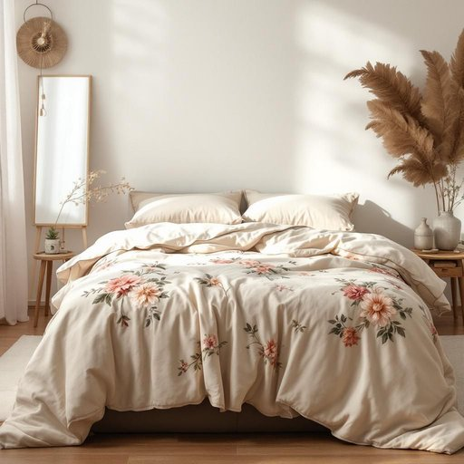

# coverlet

<h1 style="font-size: 2.5em; font-weight: 300; letter-spacing: 2px; margin: 0; color: #2c3e50;">
/coverlet*/
</h1>

---

---

## 例句

After carefully folding the delicate floral coverlet, which had been embroidered by my grandmother and passed down through generations, I placed it atop the guest bed, hoping it would add both warmth and a touch of vintage charm to the room’s otherwise modern decor.

*After(/ˈæftər/) carefully(/ˈkɛrfəli/) folding(/ˈfoʊldɪŋ/) the(/ðə/) delicate(/ˈdɛləkət/) floral(/ˈflɔrəl/) coverlet,(/coverlet*,/) which(/wɪʧ/) had(/hæd/) been(/bɪn/) embroidered(/ɛmˈbrɔɪdərd/) by(/baɪ/) my(/maɪ/) grandmother(/ˈgrændˌməðər/) and(/ənd/) passed(/pæst/) down(/daʊn/) through(/θru/) generations,(/ˌʤɛnərˈeɪʃənz,/) I(/aɪ/) placed(/pleɪst/) it(/ɪt/) atop(/əˈtɑp/) the(/ðə/) guest(/gɛst/) bed,(/bɛd,/) hoping(/ˈhoʊpɪŋ/) it(/ɪt/) would(/wʊd/) add(/æd/) both(/boʊθ/) warmth(/wɔrmθ/) and(/ənd/) a(/ə/) touch(/təʧ/) of(/əv/) vintage(/ˈvɪntɪʤ/) charm(/ʧɑrm/) to(/tɪ/) the(/ðə/) room’s(/room’s*/) otherwise(/ˈəðərˌwaɪz/) modern(/ˈmɑdərn/) decor.(/ˈdeɪkɔr./)*

**翻译：** 我小心翼翼地将那床由祖母绣制并代代相传的精美花卉被罩叠好，铺在客床上，希望它能为这个现代装饰的房间增添一丝温暖和复古的韵味。

---

## 解释

单词“coverlet”作为名词，在家居生活用品的语境中指的是一种轻便的床罩或床单，通常用于覆盖床铺，既具有装饰作用，又能起到保暖的功能。它一般比厚重的被子要薄，多用于夏季或作为床上用品的顶层覆盖物，常出现在卧室的布置描述中，如酒店、家居摆设、家纺产品介绍等场合。英语学习者在使用“coverlet”时需要注意它是可数名词，常见搭配有“a coverlet on the bed”、“a quilted coverlet”等，常与“bed”、“room”、“set”等词搭配，且不可与“blanket”或“duvet”完全互换，因为前者强调装饰和轻薄，后者则偏重保暖。语法上，“coverlet”多用单数形式出现，但描述多层床上用品时亦可用复数“coverlets”。词源方面，“coverlet”源自中古英语“coverlet”，来源于法语动词“covrir”（覆盖）的过去分词形式“couvert”，体现了其覆盖保护的功能。中文语境中，“coverlet”准确翻译为“床罩”或“薄被”，强调其轻薄、覆盖的特点，与“毯子”、“被子”区分开来，注意避免混淆。此词无特殊的褒贬色彩或文化内涵，主要是实用性的家居用语，但在文学或正式场合中使用，能够体现较为正式或传统的表达风格。

---

<small style="color: #999; font-size: 0.9em;">2025-07-27 09:14:04</small>

