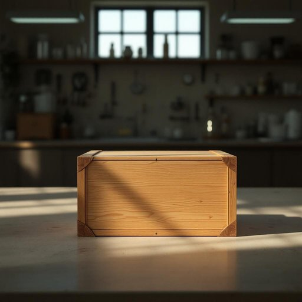

# crate

<h1 style="font-size: 2.5em; font-weight: 300; letter-spacing: 2px; margin: 0; color: #2c3e50;">
/kreɪt/
</h1>

---

---

## 例句

In the dimly lit laboratory, the crate served as a crucial container for the delicate chemical samples, its sturdy frame protecting the volatile contents from accidental spills during the hectic experiment.

*In(/ɪn/) the(/ðə/) dimly(/ˈdɪmli/) lit(/lɪt/) laboratory,(/ˈlæbrəˌtɔri,/) the(/ðə/) crate(/kreɪt/) served(/sərvd/) as(/ɛz/) a(/ə/) crucial(/ˈkruʃəl/) container(/kənˈteɪnər/) for(/fər/) the(/ðə/) delicate(/ˈdɛləkət/) chemical(/ˈkɛmɪkəl/) samples,(/ˈsæmpəlz,/) its(/ɪts/) sturdy(/ˈstərdi/) frame(/freɪm/) protecting(/prəˈtɛktɪŋ/) the(/ðə/) volatile(/ˈvɑlətəl/) contents(/ˈkɑntɛnts/) from(/frəm/) accidental(/ˌæksəˈdɛnəl/) spills(/spɪlz/) during(/ˈdʊrɪŋ/) the(/ðə/) hectic(/ˈhɛktɪk/) experiment.(/ɪkˈspɛrəmənt./)*

**翻译：** 在昏暗的实验室里，这个箱子作为盛放精密化学样品的重要容器，其坚固的结构保护着易挥发的内容物，避免在紧张的实验过程中发生意外泄漏。

---

## 解释

英语单词“crate”作为名词在家居生活用品的语境中，通常指一种由木头、塑料或金属制成的箱子或笼子，用来存放、搬运或运输物品，如水果、饮料瓶、书籍等，常见于厨房、储藏间或搬家场合。使用时需注意“crate”多指较大且带有通风孔或格状结构的容器，与普通的箱子（box）相比更适合装载体积大或形状不规则的物品。常见搭配有“a wooden crate”（木箱）、“a crate of apples”（一箱苹果）、“to pack items into a crate”（把物品装进箱子里）等，动词形式“to crate”也表示将物品装箱。在语法上，“crate”是可数名词，复数形式为“crates”，且通常与量词“a”、“one”、“some”等连用。词源方面，“crate”源自拉丁语“cratis”，意为编织的篮子，演变为现代表示箱子的含义，反映了其最初以编织材料制成的形态。中文中，“crate”常被翻译为“板条箱”或“木箱”，根据具体材质和用途也可译为“货箱”或“运输箱”，强调其用于装载和搬运的功能。该词本身无贬义或褒义色彩，属于中性词，常见于物流、家居收纳及日常生活中，体现了一种实用性和便利性。

---

<small style="color: #999; font-size: 0.9em;">2025-07-27 09:14:04</small>

