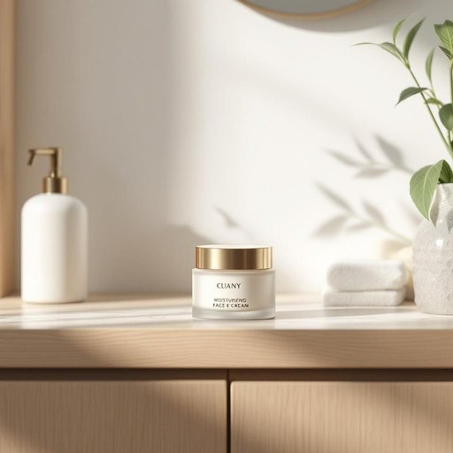

# cream

<h1 style="font-size: 2.5em; font-weight: 300; letter-spacing: 2px; margin: 0; color: #2c3e50;">
/krim/
</h1>

---

---

## 例句

Could you please pass me the cream from the fridge, the one we always use for our morning tea and the occasional dessert topping, since it’s much fresher than the long-life variety stored in the pantry?

*Could(/kʊd/) you(/ju/) please(/pliz/) pass(/pæs/) me(/mi/) the(/ðə/) cream(/krim/) from(/frəm/) the(/ðə/) fridge,(/frɪʤ,/) the(/ðə/) one(/wən/) we(/wi/) always(/ˈɔlˌweɪz/) use(/juz/) for(/fər/) our(/ɑr/) morning(/ˈmɔrnɪŋ/) tea(/ti/) and(/ənd/) the(/ðə/) occasional(/ɔˈkeɪʒənəl/) dessert(/dɪˈzərt/) topping,(/ˈtɑpɪŋ,/) since(/sɪns/) it’s(/it’s*/) much(/məʧ/) fresher(/ˈfrɛʃər/) than(/ðən/) the(/ðə/) long-life(/long-life*/) variety(/vərˈaɪəti/) stored(/stɔrd/) in(/ɪn/) the(/ðə/) pantry?(/ˈpæntri?/)*

**翻译：** 你能帮我递一下冰箱里的鲜奶油吗？就是我们平时早晨泡茶和偶尔做甜点时用的那种，比储藏室里那种长保质期的更为新鲜。

---

## 解释

英语单词"cream"作为名词在家居生活用品场景中通常指的是“乳霜”或“护肤霜”，即一种用于皮肤护理的质地较浓稠的美容或治疗产品，常用于保湿、防晒、抗皱等。具体使用场合多见于家庭浴室、化妆台或个人护理环境，比如“face cream”（面霜）、“hand cream”（护手霜）等。英语学习者在使用时需注意，作为不可数名词时通常指胶状物质，不用复数形式；搭配时常见的表达包括“apply cream”（涂抹乳霜）、“moisturizing cream”（保湿霜）等。需要避免与“cream”作为食物（奶油）混淆，语境判断尤为重要。词源上，"cream"源自古法语“creme”，进一步源于拉丁语“chīrīma”，原指奶油，后引申为质地浓稠且柔软的物质，因此在化妆品语境中借用其质感特征。中文中准确翻译为“乳霜”或“面霜”，表达产品的质地与用途，与食品中的“奶油”区分开来。在文化内涵上，“cream”作为护肤品通常带有积极、精致的生活方式色彩，不含贬义，但在某些广告和品牌语境中可能暗示优越和高端感。整体而言，理解其语境和搭配是掌握该词语的关键。

---

<small style="color: #999; font-size: 0.9em;">2025-07-27 09:14:04</small>

