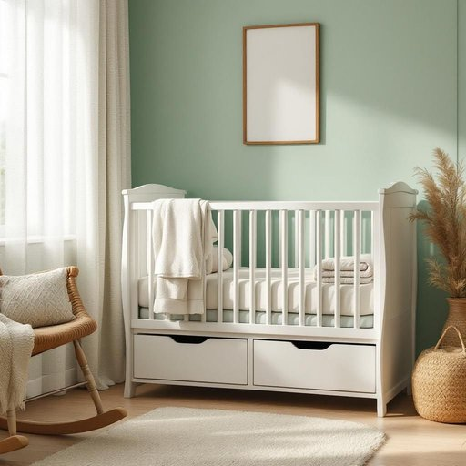

# crib

<h1 style="font-size: 2.5em; font-weight: 300; letter-spacing: 2px; margin: 0; color: #2c3e50;">
/krɪb/
</h1>

---

---

## 例句

After we finally painted the nursery a soft pastel green and assembled the vintage rocking chair by the window, we decided that the next step was to set up the crib, which, despite being compact enough to fit snugly in the corner, offered ample storage underneath for all the baby’s blankets and toys.

*After(/ˈæftər/) we(/wi/) finally(/ˈfaɪnəli/) painted(/ˈpeɪnɪd/) the(/ðə/) nursery(/ˈnərsəri/) a(/ə/) soft(/sɔft/) pastel(/pæˈstɛl/) green(/grin/) and(/ənd/) assembled(/əˈsɛmbəld/) the(/ðə/) vintage(/ˈvɪntɪʤ/) rocking(/ˈrɑkɪŋ/) chair(/ʧɛr/) by(/baɪ/) the(/ðə/) window,(/ˈwɪndoʊ,/) we(/wi/) decided(/ˌdɪˈsaɪdɪd/) that(/ðət/) the(/ðə/) next(/nɛkst/) step(/stɛp/) was(/wɑz/) to(/tɪ/) set(/sɛt/) up(/əp/) the(/ðə/) crib,(/krɪb,/) which,(/wɪʧ,/) despite(/dɪˈspaɪt/) being(/biɪŋ/) compact(/ˈkɑmpækt/) enough(/ɪˈnəf/) to(/tɪ/) fit(/fɪt/) snugly(/sˈnəgli/) in(/ɪn/) the(/ðə/) corner,(/ˈkɔrnər,/) offered(/ˈɔfərd/) ample(/ˈæmpəl/) storage(/ˈstɔrɪʤ/) underneath(/ˌəndərˈniθ/) for(/fər/) all(/ɔl/) the(/ðə/) baby’s(/baby’s*/) blankets(/ˈblæŋkəts/) and(/ənd/) toys.(/tɔɪz./)*

**翻译：** 在我们终于将婴儿房刷成柔和的粉绿色，并且在窗边组装好了那把复古的摇椅之后，我们决定下一步是安装婴儿床，虽然它小巧得刚好能紧贴角落，但床下宽敞的储物空间足以放置宝宝的所有毯子和玩具。

---

## 解释

英语单词“crib”作为名词，在家居生活用品的语境中主要指婴儿床，即专为婴幼儿设计的小床，通常带有围栏以防止婴儿跌落，常用于家庭中照顾婴儿的场合。使用时常见搭配有“baby crib”或“crib mattress”，强调婴儿的安全和睡眠环境；在语法上，“crib”作为可数名词，单数形式为“crib”，复数形式为“cribs”，需注意其可数性。需要注意的是，“crib”一词在不同语境下还有其他意义，如在学术或考试场合指“作弊小抄”，在建筑或农业中也指某种谷仓或围栏结构，但在家居用品领域主要指婴儿床。词源上，“crib”源自中古英语“cribbe”，意指小棚或喂牲畜的槽，这一原始含义逐渐演变为现在婴儿床的意思，体现了“围栏”或“小围住的空间”的特点。在中文语境中，“crib”准确翻译为“婴儿床”，强调其专门为婴儿设计的功能和安全性，无褒贬色彩，属于中性词汇，通用于育儿和家庭生活情境，使用该词时应避免混淆其其他义项，尤其在正式或特定领域语境中。

---

<small style="color: #999; font-size: 0.9em;">2025-07-27 09:14:04</small>

