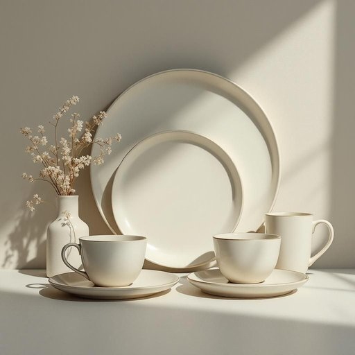

# crockery

<h1 style="font-size: 2.5em; font-weight: 300; letter-spacing: 2px; margin: 0; color: #2c3e50;">
/ˈkrɑkəri/
</h1>

---

---

## 例句

Before we set the table for tonight’s dinner party, could you please unpack the crockery from the cabinet, making sure to choose the finest plates and bowls, as well as the matching cups and saucers, so everything looks perfectly coordinated and elegant?

*Before(/ˌbiˈfɔr/) we(/wi/) set(/sɛt/) the(/ðə/) table(/ˈteɪbəl/) for(/fər/) tonight’s(/tonight’s*/) dinner(/ˈdɪnər/) party,(/ˈpɑrti,/) could(/kʊd/) you(/ju/) please(/pliz/) unpack(/ənˈpæk/) the(/ðə/) crockery(/ˈkrɑkəri/) from(/frəm/) the(/ðə/) cabinet,(/ˈkæbənət,/) making(/ˈmeɪkɪŋ/) sure(/ʃʊr/) to(/tɪ/) choose(/ʧuz/) the(/ðə/) finest(/ˈfaɪnəst/) plates(/pleɪts/) and(/ənd/) bowls,(/boʊlz,/) as(/ɛz/) well(/wɛl/) as(/ɛz/) the(/ðə/) matching(/ˈmæʧɪŋ/) cups(/kəps/) and(/ənd/) saucers,(/ˈsɔsərz,/) so(/soʊ/) everything(/ˈɛvriˌθɪŋ/) looks(/lʊks/) perfectly(/ˈpərfəktli/) coordinated(/koʊˈɔrdəneɪtɪd/) and(/ənd/) elegant?(/ˈɛləgənt?/)*

**翻译：** 在我们为今晚的晚宴摆设餐桌之前，能否请你从橱柜中取出餐具，务必挑选最精致的盘子和碗，以及配套的杯子和碟子，使整体布置既协调又优雅？

---

## 解释

英语单词“crockery”作为名词，在家居生活用品语境中指的是瓷器或陶瓷餐具，主要包括盘子、碗、杯子、碟子等用来盛装和食用食物的器皿。具体使用场合常见于描述厨房、餐厅或家庭用餐环境，比如“clean the crockery after dinner”（晚饭后清洗餐具）或“a shop selling crockery and kitchenware”（销售瓷器和厨房用具的商店）。学习者使用该词时应注意“crockery”通常不可数，不能直接使用复数形式，常见搭配有“a set/piece of crockery”（一套餐具或一件餐具）、“break the crockery”（打破餐具），以及与动词连用时多用复数含义的整体概念，如“the crockery is on the table”（餐具放在桌子上）。在词源上，“crockery”源自中古英语croke(t)，意为陶罐或小罐，进一步追溯至古英语“crocc”或法语“crock”，含义为陶器或陶罐，这反映了该词与陶瓷制品密切相关的历史背景。在中文语境中，“crockery”准确翻译为“瓷器”或“餐具”，通常指家用的陶瓷餐具，不包括玻璃器皿或金属器皿。该词本身无褒贬色彩，属于中性词汇，但在不同语境中可能隐含家庭生活的整洁与否或餐饮习惯等文化内涵，如“打碎crockery”在某些文化中象征不吉利，这点值得学习者了解。总体而言，“crockery”是描述家庭用餐环境中不可或缺的实用器具词汇，使用时重视其不可数性质及与餐具整体相关的语义。

---

<small style="color: #999; font-size: 0.9em;">2025-07-27 09:14:04</small>

