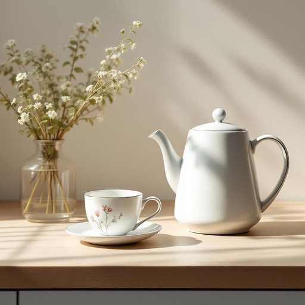

# cup

<h1 style="font-size: 2.5em; font-weight: 300; letter-spacing: 2px; margin: 0; color: #2c3e50;">
/kəp/
</h1>

---

---

## 例句

Could you please hand me the cup that’s sitting next to the kettle on the counter, the one with the floral pattern that Mum bought last summer, so I can pour myself a proper cup of tea before we start tidying up the living room?

*Could(/kʊd/) you(/ju/) please(/pliz/) hand(/hænd/) me(/mi/) the(/ðə/) cup(/kəp/) that’s(/that’s*/) sitting(/ˈsɪtɪŋ/) next(/nɛkst/) to(/tɪ/) the(/ðə/) kettle(/ˈkɛtəl/) on(/ɔn/) the(/ðə/) counter,(/ˈkaʊntər,/) the(/ðə/) one(/wən/) with(/wɪθ/) the(/ðə/) floral(/ˈflɔrəl/) pattern(/ˈpætərn/) that(/ðət/) Mum(/məm/) bought(/bɔt/) last(/læst/) summer,(/ˈsəmər,/) so(/soʊ/) I(/aɪ/) can(/kən/) pour(/pɔr/) myself(/ˌmaɪˈsɛlf/) a(/ə/) proper(/ˈprɑpər/) cup(/kəp/) of(/əv/) tea(/ti/) before(/ˌbiˈfɔr/) we(/wi/) start(/stɑrt/) tidying(/tidying*/) up(/əp/) the(/ðə/) living(/ˈlɪvɪŋ/) room?(/rum?/)*

**翻译：** 你能帮我拿一下柜台上水壶旁边那只杯子吗？就是妈妈去年夏天买的那只带花纹的，我想倒一杯茶，好在我们开始收拾客厅之前好好品一品。

---

## 解释

英语单词“cup”作为家居生活用品中的名词，主要指一种用于盛装饮料的小型容器，通常有把手，多用于喝茶、咖啡或其它热饮。在具体使用场合上，“cup”常见于厨房、餐厅、茶室等环境，表达饮用热饮时常用的器皿，如“一杯茶”（a cup of tea），“咖啡杯”（a coffee cup）。英语学习者在使用“cup”时需注意其通常可数，复数形式为“cups”，且常见搭配包括“cup of + 饮料”表示一杯某种饮品。此外，cup可与形容词连用，如“小杯子”（small cup）、“陶瓷杯”（ceramic cup），亦可用作计量单位，表示容量（如one cup of sugar，一杯糖）。词源方面，“cup”源自中古英语，追溯至古英语“cuppe”，源于拉丁语“cupa”，原意为容器或桶，体现了其作为盛器的基本功能。在中文语境中，“cup”通常准确翻译为“杯子”或“杯”，侧重于带把手且体积较小的饮用器皿，区别于“glass”（玻璃杯）、“mug”（马克杯）等其他饮具。文化上，“cup”无明显褒贬色彩，但在英美文化中，饮茶、喝咖啡常与“cup”紧密关联，具有日常生活和社交的意味，因此在表达礼仪或习惯时常被采用。综上，“cup”作为名词在家居场景中指代一种实用且普遍的饮用杯具，使用时应结合具体语境和搭配注意其语法特点和文化背景。

---

<small style="color: #999; font-size: 0.9em;">2025-07-27 09:14:04</small>

