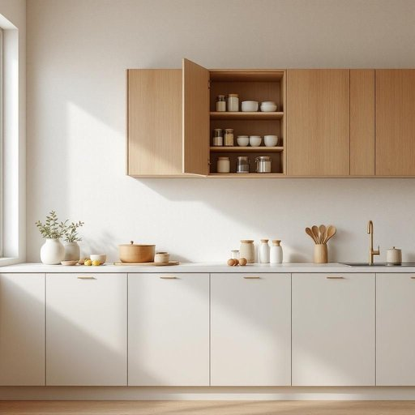

# cupboard

<h1 style="font-size: 2.5em; font-weight: 300; letter-spacing: 2px; margin: 0; color: #2c3e50;">
/ˈkəbərd/
</h1>

---

---

## 例句

Whenever you tidy the kitchen, please make sure to arrange the spices in the cupboard by size and frequency of use, as it makes cooking much more efficient and prevents clutter from accumulating on the countertops.

*Whenever(/wɛˈnɛvər/) you(/ju/) tidy(/ˈtaɪdi/) the(/ðə/) kitchen,(/ˈkɪʧən,/) please(/pliz/) make(/meɪk/) sure(/ʃʊr/) to(/tɪ/) arrange(/əreɪnʤ/) the(/ðə/) spices(/ˈspaɪsɪz/) in(/ɪn/) the(/ðə/) cupboard(/ˈkəbərd/) by(/baɪ/) size(/saɪz/) and(/ənd/) frequency(/ˈfrikwənsi/) of(/əv/) use,(/juz,/) as(/ɛz/) it(/ɪt/) makes(/meɪks/) cooking(/ˈkʊkɪŋ/) much(/məʧ/) more(/mɔr/) efficient(/ɪˈfɪʃənt/) and(/ənd/) prevents(/prɪˈvɛnts/) clutter(/ˈklətər/) from(/frəm/) accumulating(/əˈkjumjəˌleɪtɪŋ/) on(/ɔn/) the(/ðə/) countertops.(/ˈkaʊntərˌtɑps./)*

**翻译：** 每当你整理厨房时，请务必根据大小和使用频率将橱柜中的调料归类摆放，这样不仅能大大提高烹饪效率，还能防止台面杂乱堆积。

---

## 解释

英语单词“cupboard”作为名词，在家居生活用品的语境中指的是一种带门的储物柜，通常用于存放餐具、食品或厨房用具，常见于厨房、餐厅或储藏间。它具体的使用场合包括描述家中用于存放碗碟、杯子、调料瓶等物品的家具，如“I keep the plates in the cupboard”（我把盘子放在碗柜里）。英语学习者在使用“cupboard”时需要注意，它是可数名词，复数形式为“cupboards”，并且常与表示位置的词语搭配，如“kitchen cupboard”（厨房橱柜）、“wall cupboard”（壁柜）等，也常见固定搭配“cupboard door”（橱柜门）、“open/close the cupboard”（打开/关闭橱柜）。此外，“cupboard”与“closet”或“cabinet”有所区别，前者多指装餐具和食品的橱柜，后者“closet”更多指衣橱、“cabinet”则含义更广泛。词源方面，“cupboard”源自中古英语，字面意为“cup”（杯子）和“board”（板子），起源于一种用于放置杯子的小架子，后来演变为带门的储物柜。中文中“cupboard”通常翻译为“橱柜”或“碗柜”，准确理解应结合具体家居环境，表示一种固定或嵌入墙壁的带门柜子，无特殊褒贬意义，是生活中常见的实用家具。该词不带有特殊的文化内涵或隐喻，属于中性词汇。

---

<small style="color: #999; font-size: 0.9em;">2025-07-27 09:14:04</small>

