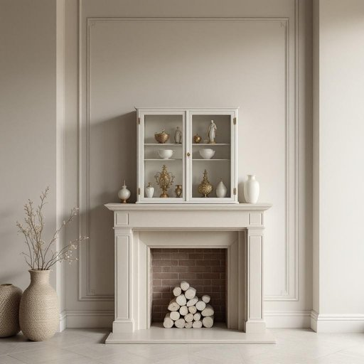

# curio

<h1 style="font-size: 2.5em; font-weight: 300; letter-spacing: 2px; margin: 0; color: #2c3e50;">
/ˈkjʊrioʊ/
</h1>

---

---

## 例句

Whenever we redecorate the living room, I insist on placing that delicate, vintage curio—filled with an assortment of rare porcelain figurines and intricate brass trinkets—on the mantelpiece, because its unique charm and history always spark fascinating conversations with our guests.

*Whenever(/wɛˈnɛvər/) we(/wi/) redecorate(/riˈdɛkərˌeɪt/) the(/ðə/) living(/ˈlɪvɪŋ/) room,(/rum,/) I(/aɪ/) insist(/ˌɪnˈsɪst/) on(/ɔn/) placing(/ˈpleɪsɪŋ/) that(/ðət/) delicate,(/ˈdɛləkət,/) vintage(/ˈvɪntɪʤ/) curio—filled(/curio—filled*/) with(/wɪθ/) an(/ən/) assortment(/əˈsɔrtmənt/) of(/əv/) rare(/rɛr/) porcelain(/ˈpɔrsələn/) figurines(/ˌfɪgjərˈinz/) and(/ənd/) intricate(/ˈɪntrəkət/) brass(/bræs/) trinkets—on(/trinkets—on*/) the(/ðə/) mantelpiece,(/mantelpiece*,/) because(/bɪˈkəz/) its(/ɪts/) unique(/juˈnik/) charm(/ʧɑrm/) and(/ənd/) history(/ˈhɪstəri/) always(/ˈɔlˌweɪz/) spark(/spɑrk/) fascinating(/ˈfæsəˌneɪtɪŋ/) conversations(/ˌkɑnvərˈseɪʃənz/) with(/wɪθ/) our(/ɑr/) guests.(/gɛsts./)*

**翻译：** 每当我们重新布置客厅时，我总坚持将那只精致的复古陈列柜——里面摆满了各式珍稀的瓷质小雕像和雕工细腻的黄铜小饰品——安放在壁炉架上，因为它独特的韵味和历史总能引发宾客间引人入胜的谈话。

---

## 解释

“curio”作为名词，在家居生活用品的语境中通常指的是一种具有独特性、收藏价值或异国情调的小型装饰品或陈列物件，常见于展示柜（curio cabinet）中，作为家中摆设以增添艺术或文化氛围。具体使用场合多见于描述那些来源于旅游地、带有历史或文化背景的精致小物件，如小摆件、纪念品、工艺品等，强调其非凡、稀奇或独特的性质。英语学习者在使用“curio”时要注意它是可数名词，通常用单数形式表示单个物品，也可用复数curios表示多件收藏品；且常与表示展示的词汇搭配，如“curio cabinet”“curio shelf”；此外，典型搭配还有“collect curios”表示收藏这些独特陈列品。词源上，“curio”源自拉丁语“curiosus”，意为“好奇的”或“有趣的物品”，经由法语进入英语，最初指引人好奇的珍品或新奇物，因而带有一定的珍稀、独特意味。在中文语境中，“curio”一般精准翻译为“珍品”“古董小摆件”或“奇珍异宝”，根据具体物品的特点可译作“收藏品”“工艺品”或“奇趣物”，强调其独特收藏价值。需要注意，“curio”带有褒义，通常不含贬义，但有时也暗示这些物品可能较为小巧不起眼，不同于价值极高的名贵古董，而是介于艺术装饰与收藏爱好之间的品类，体现个人品味和文化兴趣。

---

<small style="color: #999; font-size: 0.9em;">2025-07-27 09:14:04</small>

