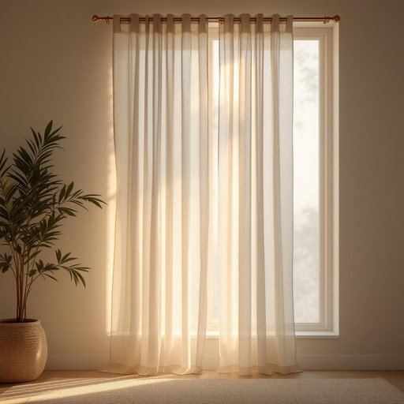

# curtain

<h1 style="font-size: 2.5em; font-weight: 300; letter-spacing: 2px; margin: 0; color: #2c3e50;">
/ˈkərtən/
</h1>

---

---

## 例句

The innovation sparked by the collaboration between researchers and industry leaders has revolutionized the approach to sustainable energy, making the concept of the environment a central focus in global policy discussions.

*The(/ðə/) innovation(/ˌɪnəˈveɪʃən/) sparked(/spɑrkt/) by(/baɪ/) the(/ðə/) collaboration(/kəˌlæbərˈeɪʃən/) between(/bɪtˈwin/) researchers(/ˈrisərʧərz/) and(/ənd/) industry(/ˈɪndəstri/) leaders(/ˈlidərz/) has(/həz/) revolutionized(/ˌrɛvəˈluʃəˌnaɪzd/) the(/ðə/) approach(/əˈproʊʧ/) to(/tɪ/) sustainable(/səˈsteɪnəbəl/) energy,(/ˈɛnərʤi,/) making(/ˈmeɪkɪŋ/) the(/ðə/) concept(/ˈkɑnsɛpt/) of(/əv/) the(/ðə/) environment(/ɪnˈvaɪrənmənt/) a(/ə/) central(/ˈsɛntrəl/) focus(/ˈfoʊkɪs/) in(/ɪn/) global(/ˈgloʊbəl/) policy(/ˈpɑləsi/) discussions.(/dɪˈskəʃənz./)*

**翻译：** 研究人员与行业领袖合作所激发的创新，彻底改变了可持续能源的推进方式，使环境理念成为全球政策讨论的核心焦点。

---

## 解释

英语单词“curtain”作为名词在家居生活用品中，通常指挂在窗户上用来遮挡光线、保护隐私或装饰房间的布制窗帘，使用场合多见于卧室、客厅或办公室等需要遮光或防窥视的地方。在语法上，curtain是可数名词，单数为curtain，复数为curtains，常见的搭配包括“draw the curtain”（拉开或拉上窗帘）、“close the curtains”（关闭窗帘）、“sheer curtains”（薄纱窗帘）等，学习者需注意复数形式常用于强调一对或多层窗帘，而单数多指单个窗帘片。词源上，curtain源自中古法语“cortine”，最终追溯至拉丁语“cortina”，意指围绕的帘幕，体现了其作为遮挡物的功能。中文语境中，curtain准确翻译为“窗帘”，涵盖了布质或类似材质的挂窗装饰物，强调实用性与美观性的结合，通常无褒贬色彩，但在文化表达中“落下帷幕”、“幕布”等相关引申义体现了停止或结束的意义，需根据具体语境区分使用。

---

<small style="color: #999; font-size: 0.9em;">2025-07-27 09:14:04</small>

