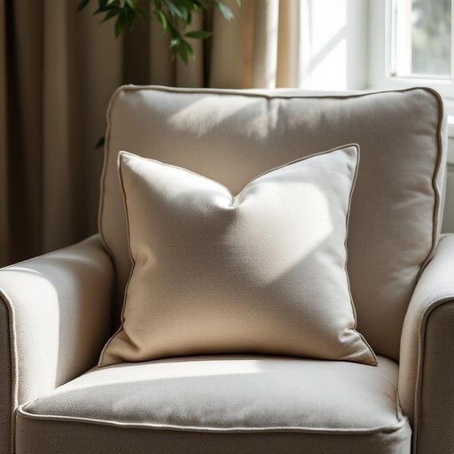

# cushion

<h1 style="font-size: 2.5em; font-weight: 300; letter-spacing: 2px; margin: 0; color: #2c3e50;">
/ˈkʊʃən/
</h1>

---

---

## 例句

The plump of the cushion on the armchair after years of use greatly improved the comfort of the living room seating.

*The(/ðə/) plump(/pləmp/) of(/əv/) the(/ðə/) cushion(/ˈkʊʃən/) on(/ɔn/) the(/ðə/) armchair(/ˈɑrmˌʧɛr/) after(/ˈæftər/) years(/jɪrz/) of(/əv/) use(/juz/) greatly(/ˈgreɪtli/) improved(/ˌɪmˈpruvd/) the(/ðə/) comfort(/ˈkəmfərt/) of(/əv/) the(/ðə/) living(/ˈlɪvɪŋ/) room(/rum/) seating.(/ˈsitɪŋ./)*

**翻译：** 经过多年使用，扶手椅坐垫的饱满度大大提升了客厅座椅的舒适度。

---

## 解释

英语单词“cushion”作为名词在家居生活用品场景中指的是用于坐垫、靠垫或装饰用途的软垫，通常填充有海绵、羽绒、棉花或合成材料，置于椅子、沙发、床或地板上以增加舒适感或美观性。具体使用场合包括家庭家具布置、室内装饰、休闲空间布局等。例如，“sofa cushions”（沙发靠垫）、“seat cushion”（座垫）等都是常见搭配。在语法方面，“cushion”作为可数名词，通常前面可以加冠词或数量词，如a cushion、two cushions，且可以用作复数形式cushions；此外，常见表达还有“cushion cover”指枕套、“throw cushion”指装饰用抱枕。学习者需注意其作为名词与作为动词“cushion”（缓冲、减轻）用法区别。词源上，“cushion”源于中古英语“cusion”，进一步来自法语“coussin”，而法语词根源自拉丁语“culcita”，意为软垫或床垫，反映了其作为柔软填充物的历史本质。在中文语境中，“cushion”一般准确翻译为“坐垫”或“靠垫”，依据具体家具用途而定，强调其提供支撑和舒适的功能，无明显褒贬色彩，属于中性且日常使用频率较高的家居生活词汇。此外，cushion在西方家居文化中常与舒适和休闲环境联系紧密，体现了对生活品质的追求，因此掌握这一词汇有助于理解和描述室内装修及生活细节。

---

<small style="color: #999; font-size: 0.9em;">2025-07-27 09:14:04</small>

